# SYNOPTRA

*The 25 Mirrors*

Sep 30, 2026 · @Roberto Bisceglie

## Introduction

Welcome. If you are holding this book, you probably already know the feeling it was written for: something in your life asks for attention, and thinking about it head-on only takes you round the same familiar loop.

SYNOPTRA is a self-reflection tool, a quiet way to step off that loop. It uses twenty-five simple glyphs, drawn from a small bag or a deck of cards, that you use to look at your situation from an angle you would not find on your own. You ask a question, you draw, you look, and you write down what you notice. Over time, the glyphs become a kind of mirror you can carry with you.

This book is everything you need to begin. It tells you where SYNOPTRA comes from and why it is shaped the way it is. It introduces the glyphs one by one, shows you how to prepare and how to read, and walks with you through sample readings and simple exercises. You do not need anything else, and you do not need any experience with other symbolic tools.

### Who this book is for

I wrote it for people who already like to pause and reflect: those who keep a journal, who pull a card in the morning, who sit with a question before answering it. If you have used tarot, runes, the I Ching or an oracle deck, much here will feel familiar, and some things will feel refreshingly different. If you have never used anything like this, you are in the right place too. SYNOPTRA was designed to be easy to learn.

And if you are a little skeptical, that is welcome. SYNOPTRA asks you to believe nothing. It only asks you to look.

### What SYNOPTRA will not do

I want to be honest with you from the first page. SYNOPTRA does not tell the future, and the glyphs do not carry messages from anywhere. When a reading moves you, it is because you saw something true about your own life, with the glyph as the occasion. That is not a smaller thing. In my experience it is the thing that matters.

SYNOPTRA is a self-reflection tool, not therapy. It can help you notice what needs care, but it does not replace the people who can give that care. We will come back to this gently at the end of the book.

Finally, SYNOPTRA is new. It was designed in 2025, and it has no ancient lineage or secret origin. I think that is part of its charm: you can see how every piece works, and nothing asks for your faith.

### How to use this book

The book follows the path I would take if I were teaching you at a kitchen table. **Part One** tells the story behind the tool: why it exists, the ideas from Carl Gustav Jung that inspired it, and the principles that shaped it. **Part Two** introduces the glyphs themselves: the grid they live in, how they are drawn, their names, and a full portrait of each one. **Part Three** is the practice: preparing, reading, the spreads, sample readings, and exercises to make the glyphs your own. **Part Four** closes with a few words about limits, and a quick reference to keep beside you while you read.

If you are eager to start, read Chapter 4, then Chapter 9, then Chapter 11, and draw your first glyph today. The background will still be here when you want it.

### A few words we will use

Some words have a particular sense in this book. A **glyph** is one of the twenty-five symbols. Each glyph belongs to a **dimension**, the area of life it speaks about, and a **phase**, the moment of change it describes. Every glyph has a **meaning**, its helpful side, and a **shadow**, the way the same thing can get in your way. A **spread** is a layout of positions for your glyphs, and to **draw** is to take them at random, one at a time.

The person who asks and reads is called the **consultant**. In SYNOPTRA there is no reader standing between you and the glyphs. You ask, you look, and you are the one who answers.

# Part One: Background

## Chapter 1: Why SYNOPTRA Exists

Some of the clearest moments in a life arrive sideways. A friend asks a question you did not expect. A line in a novel lands on the wrong day and suddenly means everything. A dream leaves an image you cannot shake. In each case, something that was not made for your problem gives your attention a new place to stand, and from there you see what you half knew all along.

SYNOPTRA exists to invite those moments on purpose.

### The trouble with thinking straight at things

When something in our life is not right, our first instinct is to think about it directly. Usually that does not get us very far. Our thoughts run along the same tracks they always do. We rehearse the same arguments and arrive at the same conclusions, or the same lack of them. A blank page does not help much either, because on a blank page we simply write what we already think.

What helps is a gentle interruption. Symbolic tools have offered this for a very long time. A card, a hexagram, a carved sign: each gives you an image rich enough to hold many readings and open enough not to force one. You look at it with your situation in mind, and the situation quietly rearranges itself around the image.

### Why a new set of symbols?

I have spent time with several of these tools, and I have real affection for them. Over the years, though, I kept bumping into the same small frictions.

The imagery of most traditional tools belongs to a particular time and place. The classic tarot is full of late medieval Christian pictures; rune sets carry Germanic names and a modern esoteric layer added mostly in the last century. To use them fully, you either borrow their world or keep translating it into yours.

Many traditions also describe the draw as a message from somewhere: fate, the universe, a wise unconscious. That never sat right with me, and I did not want a tool whose instructions asked me to pretend.

And many of these systems are large. Seventy-eight cards, sixty-four hexagrams. Their structure is real and beautiful, but it is old and layered, and a beginner mostly ends up memorizing. The I Ching is a partial exception, because its hexagrams are built from simpler figures. SYNOPTRA shares that principle, and Chapter 3 comes back to it.

None of this makes those tools any less valuable. It simply made me want something different for my own practice: something small, clear, contemporary and honest. SYNOPTRA is what grew out of that wish.

### What SYNOPTRA offers

SYNOPTRA is a self-reflection tool that works through **projection**, our natural habit of seeing ourselves in what we look at. You will meet that idea properly in the next chapter. For now, it is enough to know three things about the tool.

It is **small**. There are twenty-five glyphs, and even the largest spread uses only five.

It is **clear**. The glyphs live in a five by five grid, and each one can be understood from its place in that grid. Learn ten simple elements and you can recognize all twenty-five, and begin to guess what each one is about.

It is **honest**. A glyph does not know anything about you. It offers your attention a shape, and you do the rest. Nothing more is claimed, and nothing more is needed.

This also means SYNOPTRA does not depend on what you believe. If you like to think of the draw as a meaningful coincidence, you can. If you see it as a random prompt, that works just as well. You will follow the same steps, ask the same questions and fill the same pages either way.

### About the name

*SYNOPTRA* joins two Greek parts: *syn-*, "together", and *-optron*, "an instrument for seeing", the ending of *katoptron*, the Greek word for a mirror. Put together, the name means "to see together". The same *syn-* also opens the word *synchronicity*, the idea from Jung that first set this project in motion. The subtitle, *The 25 Mirrors*, says what the glyphs are for. A mirror adds nothing to what stands in front of it. It simply lets you see what was already there, from an angle you could not reach alone.

## Chapter 2: Ideas Borrowed from Jung

SYNOPTRA owes its first spark to Carl Gustav Jung, the Swiss psychiatrist who took symbols, dreams and even divination seriously as windows into the psyche. Three of his ideas run through this book: **projection**, **the shadow** and **synchronicity**. You do not need to study Jung, or to accept his theories, to use SYNOPTRA, and I am not a psychologist. But knowing these three ideas will help you understand why the glyphs work the way they do, and how to get the most from them.

### Projection: seeing ourselves in what we see

Have you ever met someone and disliked them at once, before they had done anything at all? Or walked into an empty house and felt that it was sad? Jung called this kind of experience projection: we place something from inside ourselves onto something outside, and then we meet it there as if it had always belonged to the other person or the house.

Projection is not a flaw. It is simply how we perceive when what we look at is open to interpretation. The more ambiguous the object, the more of ourselves we pour into it. Psychologists have long built tests on this idea, showing people inkblots or unclear pictures and listening to what they see. How much those tests can really reveal is still debated, and SYNOPTRA does not depend on them. It borrows only the simple, everyday observation that an open image invites us to bring something of our own.

SYNOPTRA works in the same way, with one important difference: here, **nobody interprets you from outside**. The glyph is the open image, your question focuses your attention, and you are the one who notices what rises. Your first reaction, the memories that surface, the choice you make between the light and dark sides of a glyph: all of that is the reading.

This gives the whole tool its heart: *the glyph knows nothing about your situation; your reading is what gives it meaning.* Everything you will learn in Part Three grows from that simple idea.

### The shadow: every gift has another face

For Jung, the shadow is the part of ourselves we do not recognize as ours. It holds the traits and feelings that do not fit the picture we have of who we are. It is not simply our "bad" side. Often it holds strengths we need, waiting behind the door we keep closed.

SYNOPTRA borrows one gentle lesson from this idea: **any quality can turn into an obstacle**. Steadiness can become stiffness. Openness can become exposure. A bond that holds us can also hold us back. So every glyph has two faces. Its **meaning** is the helpful, generative side. Its **shadow** is the same energy when it blocks or hurts.

This changes how a reading feels. No glyph is simply good news or bad news. When you draw RADHEN, the Root, the question is never "is this positive?" It is "is this root holding me up, or holding me down?" That question is where much of the real work of a reading happens. Chapter 3 explains why every single glyph, without exception, carries both faces.

### Synchronicity: the inspiration

Jung used the word synchronicity for meaningful coincidences: moments when something inside us and something in the world line up in a way that feels significant, without one causing the other. His best-known story is about a patient describing a dream of a golden scarab, just as a similar beetle tapped against the window. He wrote about the idea at length in 1952, in an essay published alongside a work by the physicist Wolfgang Pauli, and he used it to understand why the I Ching so often seemed to speak to the moment.

Synchronicity is where SYNOPTRA began. It is in the name, and it is behind the image of a small set of symbols meeting a living question.

It is worth being clear, though, that synchronicity makes a bigger claim than projection does. It suggests a real connection between our inner life and outer events, and there is no scientific evidence for such a link. So SYNOPTRA does not rest on it. Projection is how the tool works, and it is all the tool needs.

If you find it meaningful to approach your draws as synchronicities, please do. Taking a draw seriously can help you take your own reflection seriously. If that frame does not suit you, nothing changes. The draw is a random prompt, and randomness is precious exactly because your habits did not choose it.

### What SYNOPTRA leaves aside

Some other parts of Jung's thought often travel with symbolic tools. SYNOPTRA lets them go, so that the tool stays light.

It does not claim that its glyphs are **archetypes**, or that their shapes carry universal meanings. A circle stands for Transformation here because SYNOPTRA gives it that role, not because circles mean change everywhere. It makes no claim about a **collective unconscious**: everything a reading needs happens between one person and one glyph. And it does not pretend to be **analysis**. Jungian analysis is a relationship with a trained person, and a set of glyphs cannot replace that.

### A few gentle cautions

Projection is a wonderful tool, and like every tool it has its habits. Knowing them will make you a better reader.

We tend to see what we already believe. That is one reason every glyph has a shadow: when a reading simply agrees with you, try the other face and see whether it fits better. Vague descriptions also feel personal to almost anyone, a well-known effect that psychologists study. The remedy is to make your reading specific: name the person, the moment, the choice. And our mood colors what we see. A reading done on a hard day tends to find hard things. That is no reason to avoid reading when life is difficult, but it is a good reason to read your notes again later, on a calmer day.

These are not faults to fix. They are part of what it means to look into a mirror. The method in Part Three is designed to keep them gently in view.

## Chapter 3: How SYNOPTRA Is Shaped

Every part of SYNOPTRA was shaped by a handful of choices. You do not need to know them to read the glyphs, but I think you will enjoy the tool more, and use it more freely, once you see why it looks the way it does.

### Four things a mirror should not do

When I set out to build SYNOPTRA, I made a short list of things I did not want it to do.

I did not want it to **promise one thing and do another**, describing itself as a message from beyond while really working as a prompt for reflection. I did not want it to **lean on borrowed mystique**, words like "sacred" or "ancient" that make claims the tool cannot keep. I did not want **symbols that look alike**, so that you would hesitate at the table over which one you had drawn. And I did not want **symbols that are only good or only bad**, because a glyph that can only comfort or only warn has nothing left to show you.

Each of the choices below answers one of those wishes.

### Honest about how it works

If a draw were a message from fate, a disappointing reading would mean a disappointing fate. Since a draw is an invitation to reflect, a reading that does not speak to you is simply an invitation that did not land this time, and that is perfectly fine.

This is why SYNOPTRA rests on projection and nothing more. Synchronicity remains its inspiration, open to anyone who finds it helpful, but nothing in the method depends on it.

The same spirit runs through the language of this book. You will not find "sacred geometry" here, or a secret lineage, and you will not find other traditions criticized to make this one look better. Where a glyph happens to resemble an older symbol, or the tool as a whole resembles an older system, I simply say so.

### A grid where every place means something

Twenty-five symbols could have been five groups of five, like five little families. But then nothing would link the first symbol of one family to the first of another, and you would be left memorizing twenty-five separate things.

So SYNOPTRA uses a true grid with two directions. Each **row** is a dimension, an area of life. Each **column** is a phase, a moment in a process of change. Every glyph sits where a row and a column meet, and that meeting point already tells you much of what it means.

The five phases come from something we all know about change. It starts as a hidden possibility. Then something breaks open. Then there is quiet work that nobody sees. Then the new thing comes out into the light. And finally it settles, closes, and becomes the soil for whatever comes next. You can see the whole story in the first row: Seed, Fracture, Chrysalis, Emergence, Ash. Every other row tells the same story in its own part of life, which is why, for example, the last glyph of Movement is **Return**, a journey that closes by coming home.

### A simple way of drawing

Because each column is a phase, the phase can be drawn. So instead of twenty-five unrelated pictures, SYNOPTRA has five basic shapes, one for each dimension, and five small marks, one for each phase. Every glyph is just one shape with one mark.

This has a lovely side effect. No two glyphs can ever be confused, however quickly you sketch them. And glyphs of the same phase share the same mark, so you start to see families across the grid without even trying. You will meet the shapes and marks in Chapter 5.

### A kinship with the I Ching

If you know the I Ching, the last two sections may have sounded familiar. Its sixty-four hexagrams are not sixty-four separate pictures either. Each one is made of two three-line figures, the trigrams, and there are only eight of those. Learn the eight and you can begin to read all sixty-four. SYNOPTRA uses the same principle at a smaller scale: ten elements, twenty-five glyphs.

The two tools also share a subject. The I Ching is the Book of Changes, and the six lines of a hexagram are read from the bottom up as the stages of a situation. The five phases of SYNOPTRA do a similar job. And when you build a glyph with two dice, one for the row and one for the phase, you are doing something close to what a reader of the I Ching does with coins, building a hexagram line by line.

The differences matter just as much. A hexagram joins two figures of the same kind, and what counts is which one sits above the other. A glyph crosses two different things: an area of life and a moment of change. A hexagram can have changing lines that turn it into a second hexagram, so the reading itself moves from one state to another. A glyph stays as it is, and in SYNOPTRA movement comes only from the positions of a spread. Finally, the I Ching speaks. Its text gives judgments and advice. A glyph offers two faces, and you choose between them.

So SYNOPTRA is not a small I Ching, and it borrows none of its texts or its authority. But the kinship is real, and it is fairer to name it than to leave you to notice it alone.

### Two faces for every glyph

A symbol that is only kind works like a compliment, and one that is only harsh works like a warning. Neither invites you to look a little longer. So every glyph has a meaning and a shadow, a helpful face and a difficult one.

Which face is showing is always your choice, never decided by whether the glyph lands upside down. That is why SYNOPTRA has no reversed glyphs. The most important judgment in a reading stays where it belongs: with you.

### Names that are easy to remember

Each glyph has an invented name built on an old root from Latin, Greek or a Germanic language. The names are not meant to be mysterious. Their sound hints at their sense, so they settle easily in memory. And each name begins with a different letter, which keeps them from blurring together and lets you write down a whole reading in a handful of letters. Chapter 6 shows you how.

### Spreads that mean what they say

A spread works best when every position has its meaning decided before you draw. Otherwise it is all too easy to decide what a position means after seeing the glyph, and then the reading only tells you what you wanted to hear.

The spreads also have plain names. The five-glyph spread is called the **Quincunx**, which is simply the pattern of five dots on a die. It describes the shape, and nothing more.

### Three simple principles

If you ever want to adapt SYNOPTRA to your own practice, these three principles are a good compass.

1. **Promise only what the tool can do.** Every overstatement creates a contradiction somewhere else.
2. **Let structure carry the weight.** One clear pattern is easier to live with than twenty-five things to memorize.
3. **Give every symbol two faces.** A glyph that can only be good cannot surprise you.

### One question behind them all

The three principles can be gathered into a single question, and it is the one I ask before adding anything to SYNOPTRA, whether a new spread, a new rule or a new page in this book: *does this help a person see their situation from a new place, or does it pretend to add knowledge the glyphs do not have?* If it does the first, it belongs. If it does the second, it does not, however beautiful it may be.

# Part Two: Fundamentals

## Chapter 4: The Grid

Every glyph in SYNOPTRA answers two quiet questions at once. *Where* in your life is something happening? And *at what moment* of its change does it stand? The first answer is the glyph's dimension, its row. The second is its phase, its column. Once you have these ten ideas in your hands, you can find your way toward any glyph, even before you remember its name.

Here is the whole grid. Take a moment with it before you read on.

|  | 1 Latency | 2 Crisis | 3 Process | 4 Manifestation | 5 Completion |
| :-- | :-- | :-- | :-- | :-- | :-- |
| **T** Transformation | GERMA, Seed | BREKA, Fracture | UMVEL, Chrysalis | EMRAL, Emergence | ASKOR, Ash |
| **R** Relation | LIMYR, Threshold | DISTEN, Abyss | MIREN, Mirror | THEKNA, Knot | SONAL, Resonance |
| **M** Movement | RADHEN, Root | JEKTA, Leap | FLUEN, Current | VEKTOR, Path | CYRKEL, Return |
| **K** Knowledge | HULMEN, Veil | QUERIK, Labyrinth | IKNOR, Trace | KLAVEN, Key | OKULAR, Witness |
| **I** Integration | ZERAN, Void | PARTEN, Fragment | NEXAL, Fulcrum | XUNDA, Overflow | WEVAN, Weave |

### The five dimensions

The dimensions are five ways of looking at one life. They overlap, as they should: a change of job, for instance, touches all of them. When a glyph comes up, its dimension tells you which side of your situation it is inviting you to look at.

**Transformation** is about the self that changes. Who are you becoming? What are you leaving behind? This row follows the cycles of ending and beginning in your own identity. Its question is simple: *what is changing in me?*

**Relation** is about the space between you and someone else. Not the other person alone, and not you alone, but what you share: a boundary, a distance, a bond. The "other" might be a partner, a friend, a group, or even a part of yourself that feels like a stranger. Its question is: *what is happening between us?*

**Movement** is about action and direction. Standing still, leaping, flowing, steering, coming home. Its question is: *how am I moving, or not moving?*

**Knowledge** is about understanding. What is hidden, what is confusing, what can be pieced together from clues, what suddenly becomes clear, what is simply seen. Its question is: *what do I know, and how do I know it?*

**Integration** is about how the pieces fit together, in a life, a project or a self. An empty space, a piece breaking away, a delicate balance, an abundance, a woven whole. Its question is: *how do the parts fit?*

### The five phases

The phases tell one story, the story of how any change unfolds. They mean the same thing in every row.

**Latency** is the first moment: something is there, but not yet active. A seed in the ground, a threshold not yet crossed. It is full of promise, and its risk is that the promise never comes to anything.

**Crisis** is the moment something breaks or opens. The old form cannot hold any more. This is not necessarily bad news: a crisis is often how something closed becomes open. Its risk is a break that leads nowhere.

**Process** is the hidden work. Something is under way, but nobody can see it from outside, like the changes inside a chrysalis. Its risk is that the hiding place becomes a place to hide.

**Manifestation** is the coming out. A new form appears, a bond is spoken aloud, a direction is chosen, a door opens. Its risk is showing something before it is ready, or holding it too tightly once it is shown.

**Completion** is the closing of the circle. A cycle ends and feeds the next, two voices find their harmony, a journey returns home. Its risk is refusing to let the ending happen, or turning the finished thing into a cage.

The phases are a circle as much as a line. Completion prepares the next Latency: ASKOR, the Ash, is also the soil where a new GERMA, the Seed, can grow.

### Finding your way to any glyph

Because every glyph lives where a row meets a column, you can often guess its sense by combining the two. Try it before you look anything up.

THEKNA sits where Relation meets Manifestation: a relationship that becomes visible, a commitment spoken aloud. QUERIK sits where Knowledge meets Crisis: the moment understanding breaks down and the map stops working. NEXAL sits where Integration meets Process: the parts of something still adjusting to each other, quietly searching for balance. And CYRKEL sits where Movement meets Completion: arriving back where you began, changed by the journey.

The grid does not replace each glyph's own name and portrait in Chapter 7. It gives you a way in when you forget them, and a second layer of meaning when you remember them. In Chapter 9, you will see how the grid can also help you read a whole spread at a glance.

### Recognize, infer, interpret

It helps to be honest about how far the grid can take you. Meeting a glyph happens in three steps.

First you **recognize** it: the shape tells you the row, the mark tells you the column. This takes a glance, and the ten elements are enough.

Then you **infer**: by combining the row and the column, you can guess the general direction of the glyph. A circle with a wavy line is something changing in the self, out of sight. That is a real starting point, but it is not yet a meaning.

Finally you **interpret**: you bring that direction into your own situation and see what it touches. This step belongs to you alone. No grid and no book can take it for you, and that is exactly as it should be. The grid gives you a direction; your life gives it a meaning.

## Chapter 5: Drawing the Glyphs

Every SYNOPTRA glyph is made the same way: **the shape of its dimension, with the mark of its phase**. Thin dark lines on a light ground, and nothing more. Five shapes and five marks give you all twenty-five glyphs.

### The five shapes

**Transformation is a circle.** It is perhaps the oldest picture of a cycle, with no start and no end, so it can hold both.

**Relation is a mandorla**, the almond shape that appears where two circles overlap. Two separate forms share a space, and the relationship is quite literally that shared space.

**Movement is a triangle pointing upward.** It has a direction, a base to push from and a tip that rises.

**Knowledge is a rhombus**, tall and narrow, about twice as tall as it is wide. It looks a little like a lens or an eye, something that focuses and sees, and it shares its proportions with the mandorla: two pointed shapes for the two dimensions that look outward, toward the other and toward what is unknown.

**Integration is a square.** Four equal sides fitted together: the simplest picture of parts making a steady whole.

These associations are there to help you remember. They are not claims about what these shapes mean everywhere in the world. Within SYNOPTRA, a triangle stands for Movement because that is its role here, and the reasons simply make the role easy to keep in mind.

### The five marks

**Latency is a dot at the center:** a single point, present but not yet unfolded.

**Crisis is a gap in the outline, at the top:** the form has been broken open.

**Process is a gentle wavy line inside the shape:** movement happening within, held by the outline.

**Manifestation is a line rising from the center and passing out through the top:** something inside comes out into the light.

**Completion is a second, smaller copy of the shape inside the first:** the form holds itself, closed and whole.

Read the marks in order and they tell a small story of their own: a point, a break, a stirring within, an emergence, a closing. It is the same story the phases tell.

### What this simple rule gives you

Because every glyph is one shape plus one mark, **every glyph has a combination of its own**. On paper, any two glyphs differ in shape, in mark, or in both. By hand, a few of them ask for a little care: a gap that is clearly open, a line that starts at the very center, an inner shape small enough to stand apart. The tips later in this chapter will help.

You also **only need to learn ten things** to recognize all twenty-five glyphs. When you draw one, its shape tells you the row and its mark tells you the column, at a glance.

And you will start to **see families**. Every glyph of the Crisis phase has a gap; every glyph of Completion is doubled. When two glyphs in a spread share a mark, your eye will catch the connection before your mind names it. Chapter 9 shows how to use this.

### Making the glyphs by hand

Sooner or later you will probably want to draw the glyphs yourself, on wooden tiles, cards, smooth stones or the margins of your journal. A few tips will keep them clear.

Draw the shape first, then add the mark. Keep the dot of Latency small and right in the middle, so it does not look like a filled shape. Make the gap of Crisis easy to see, about a fifth of the shape's width, centered at the top; on the triangle and the rhombus, it opens at the point. Let the wavy line of Process float inside without touching the outline. Start the line of Manifestation at the very center and carry it clearly past the top edge, so it reads as something coming out rather than something attached. And make the inner shape of Completion about half the size of the outer one, so the space between them is easy to see.

Two shapes take a little practice. For the mandorla, lightly draw two overlapping circles, trace the almond where they meet, and erase the rest. For the rhombus, keep it clearly narrow: a rhombus as wide as it is tall is only a square turned on its corner, and on a round tile it could be mistaken for one of the Integration glyphs.

### Familiar shapes

With such a small vocabulary of dots, lines, circles and squares, some glyphs inevitably resemble symbols from other traditions. A circle with a dot at its center is also an old sign for the Sun. The mandorla appears in medieval art and in modern geometric design. Squares within squares turn up almost everywhere.

These resemblances are happy accidents of simplicity. Within SYNOPTRA, GERMA means Seed, not the Sun. If a resemblance stirs an association for you during a reading, welcome it like any other: as something that comes from you, not as a hidden meaning of the glyph.

## Chapter 6: Names, Letters and Codes

Every glyph can be called in a few different ways, and each one has its moment. Its **name**, like MIREN, is the one you will think and speak with. Its **concept**, like Mirror, is the plain word you can use to explain it to a friend. Its **initial**, a single letter, lets you jot down a reading in seconds. And its **code**, like R3, shows its place in the grid: the row letter and the column number.

### Why invented names?

A familiar word like "Mirror" already has a settled meaning in your mind. That helps, but it also closes the symbol a little. An invented name is a small open room that belongs only to its glyph. As you read with it over the months, that room slowly fills with your own experiences of it.

The names are not random, though. Each grows from an old root in Latin, Greek or a Germanic language, so that its sound gently points toward its sense. They are not meant to sound neutral or mysterious; they are meant to be easy to remember.

### Where the names come from

You do not need these roots to read the glyphs, but many people find that knowing them helps the names stick.

| Code | Name | Concept | Root |
| :-- | :-- | :-- | :-- |
| T1 | GERMA | Seed | Latin *germen*, sprout |
| T2 | BREKA | Fracture | Germanic *break* |
| T3 | UMVEL | Chrysalis | German *um*, around, and Latin *velum*, covering |
| T4 | EMRAL | Emergence | Latin *emergere*, to rise out |
| T5 | ASKOR | Ash | Germanic *ask-*, ash |
| R1 | LIMYR | Threshold | Latin *limen*, threshold |
| R2 | DISTEN | Abyss | Latin *distantia*, distance |
| R3 | MIREN | Mirror | Latin *mirari*, to look at with wonder |
| R4 | THEKNA | Knot | Greek *synthēkē*, compact, covenant |
| R5 | SONAL | Resonance | Latin *sonus*, sound |
| M1 | RADHEN | Root | Latin *radix*, root |
| M2 | JEKTA | Leap | Latin *iacere*, to throw |
| M3 | FLUEN | Current | Latin *fluere*, to flow |
| M4 | VEKTOR | Path | Latin *vector*, carrier |
| M5 | CYRKEL | Return | Greek *kirkos*, ring |
| K1 | HULMEN | Veil | Germanic *hul-*, to cover |
| K2 | QUERIK | Labyrinth | Latin *quaerere*, to seek |
| K3 | IKNOR | Trace | Greek *ichnos*, footprint |
| K4 | KLAVEN | Key | Latin *clavis*, key |
| K5 | OKULAR | Witness | Latin *oculus*, eye |
| I1 | ZERAN | Void | *Zero* |
| I2 | PARTEN | Fragment | Latin *pars*, part |
| I3 | NEXAL | Fulcrum | Latin *nexus*, bond |
| I4 | XUNDA | Overflow | Latin *exundare*, to overflow |
| I5 | WEVAN | Weave | Old English *wefan*, to weave |

### One letter for each glyph

Every name begins with a different letter. Between them, the twenty-five glyphs use every letter of the alphabet except Y. So each glyph can be written as a single letter, and a whole five-glyph reading fits in five.

This is a small gift to your journal. A line like `M E H P C` records an entire Quincunx, and after a little practice you will read it as easily as the names themselves: MIREN, EMRAL, HULMEN, PARTEN, CYRKEL.

Two letters do double duty. **K** is KLAVEN, and it is also the letter of the Knowledge row. **I** is IKNOR, and also the letter of the Integration row. In practice this causes no confusion, because a glyph's initial always stands alone, while a code always carries a number, like K4 or I3.

### Codes

Codes are less poetic than names, but they make patterns jump out. Write a reading as `R3 T4 K1 I2 M5` and you can see at once that every row and every column appears exactly once. That is a reading spread evenly across the whole grid, and as you will see in Chapter 9, that in itself is worth noticing.

### Saying the names

There is no official pronunciation. A simple, comfortable choice is to read the names as you would in Italian: every letter sounded, the stress on the first syllable, K and C always hard. Whatever you choose, keep it steady. A name that always sounds the same settles more easily into memory.

## Chapter 7: The Twenty-Five Glyphs

Here are the glyphs, one by one. Before you meet them, one gentle rule: **these pages are a grammar, not an answer.** When a glyph comes up in a reading, look at it and write your own reaction first. Only then turn to its portrait. If you read the book before you look, the book will do your seeing for you.

Each portrait tells you how the glyph is drawn, what it offers in its light, what it can become in its shadow, two questions to sit with, and a few pairs to try when it shares a spread with other glyphs. All of it is a place to start, not a place to stop. Over time, your own readings will add far more than any book can.

### Transformation: the circle

The first row follows the self through a whole cycle of change, from a seed in the dark to the ash that feeds the next seed.

#### T1 GERMA, the Seed

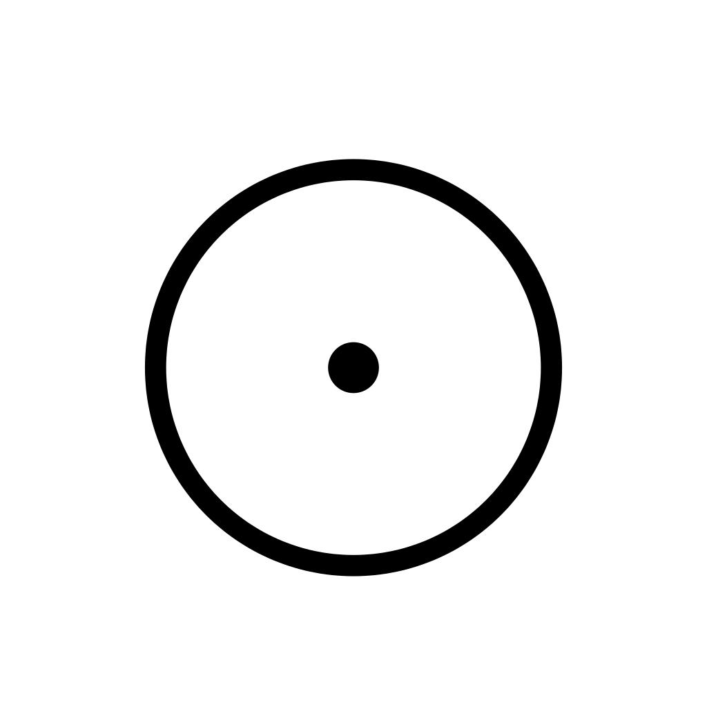

*A circle with a dot at its center.*

Something in you is ready to grow. It already exists, though no one can see it yet, perhaps not even you. GERMA asks for patience and good conditions more than effort: water, light, time.

**In shadow**, the seed waits forever. The right moment is always later, and the potential never becomes anything.

*To sit with:* What in me is waiting to begin? Am I protecting this seed, or hiding behind it?

*Pairs to try:*

- **ZERAN, the Void.** A seed and empty soil. Together they ask what you will plant, and whether you are ready to.
- **RADHEN, the Root.** Two kinds of gathered strength. Waiting that is chosen and fruitful, or, in shadow, a double stillness.
- **ASKOR, the Ash.** The end of the row beside its beginning. Something that has closed is making room for what is about to grow.

#### T2 BREKA, the Fracture

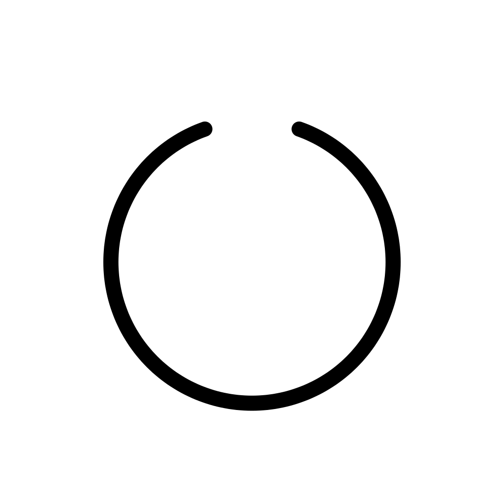

*A circle with a gap at the top.*

An old shape of yourself is cracking open: a habit, a role, a way of seeing yourself. It may hurt, but the crack is also how light gets in and how something new gets out.

**In shadow**, the break opens nothing. It is collapse for its own sake, endured or even sought, with nothing growing from it.

*To sit with:* What part of me is breaking? What is this opening letting through?

*Pairs to try:*

- **QUERIK, the Labyrinth.** The self cracks and the map fails at the same time. The search and the change may be one process.
- **JEKTA, the Leap.** A break you suffer beside a break you choose. Ask which one is really yours.
- **EMRAL, the Emergence.** The crack and what comes through it. The fracture may be the way out.

#### T3 UMVEL, the Chrysalis

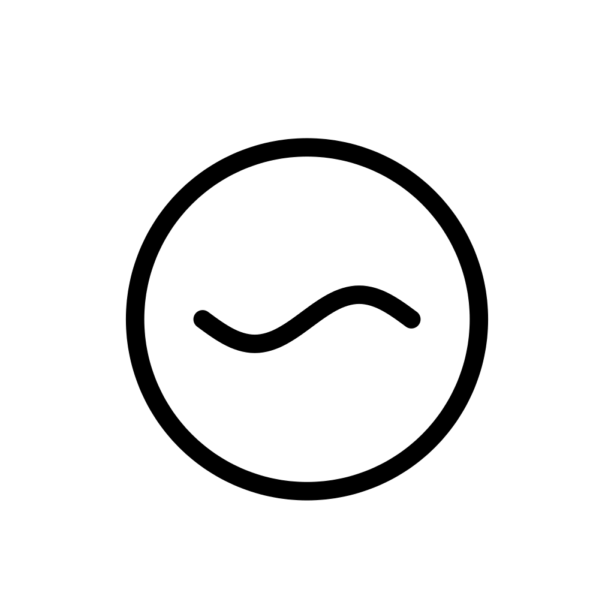

*A circle with a wavy line inside.*

You are changing on the inside, in a place where no one can watch. This is incubation: real, quiet, protected work that needs its shelter.

**In shadow**, the shelter becomes a shell. Protection turns into a refusal to come out.

*To sit with:* What is changing in me that I cannot show yet? Do I still need this shelter?

*Pairs to try:*

- **HULMEN, the Veil.** Hidden change and hidden knowledge. Something is working in you that you are not yet meant to see, or would rather not see.
- **MIREN, the Mirror.** Another person may show you the change you cannot yet see in yourself.
- **LIMYR, the Threshold.** The shelter and the door. When is it time to come out, and who is waiting there?

#### T4 EMRAL, the Emergence

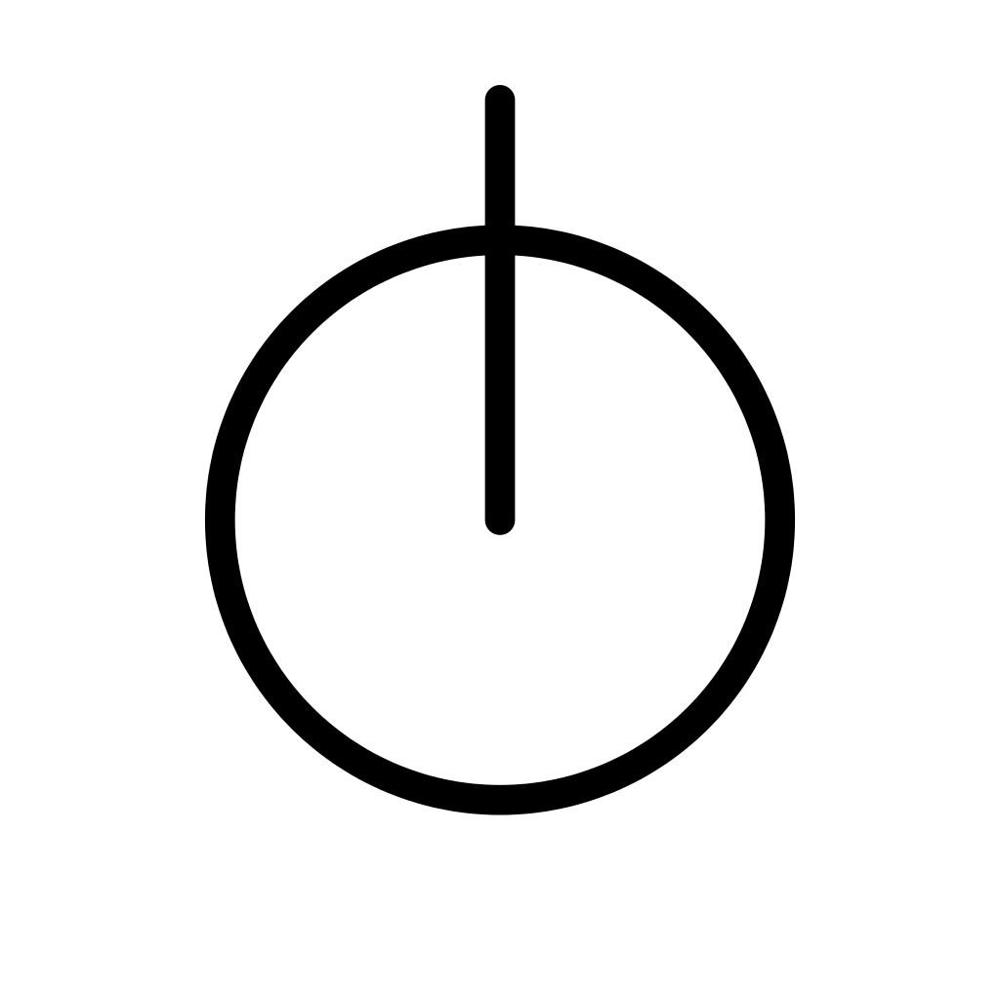

*A circle with a line rising from its center and out through the top.*

A new version of you is coming into the light. What grew inside is now ready to be seen, and the world is about to meet it.

**In shadow**, it comes out too soon. The new form is still fragile, or it is pushed out before it is ready.

*To sit with:* What part of me wants to be seen now? Is it ready for the light it will meet?

*Pairs to try:*

- **THEKNA, the Knot.** A new self and a declared bond appear together. Being seen, at last, inside a relationship.
- **KLAVEN, the Key.** An insight that lets you show yourself. In shadow, a certainty that comes out too early.
- **UMVEL, the Chrysalis.** The moment before and the moment of. Ask whether the inner work is truly finished.

#### T5 ASKOR, the Ash

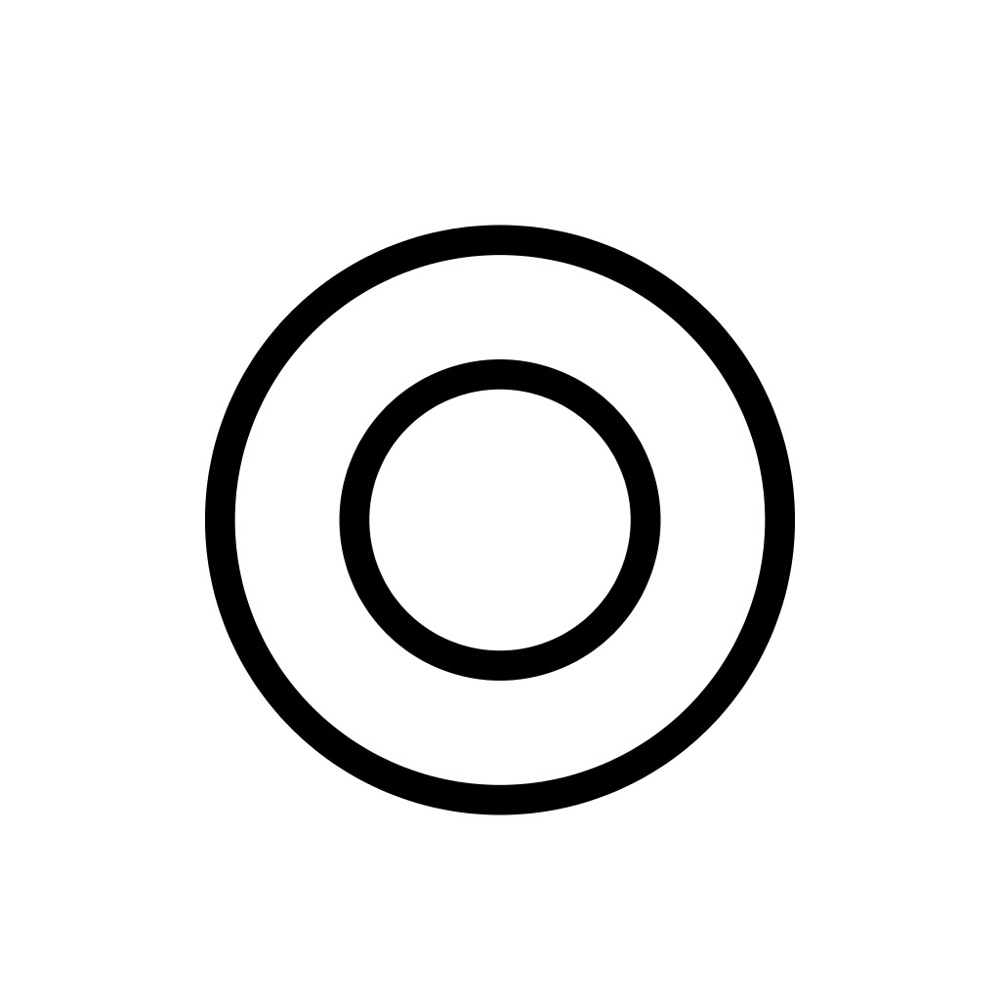

*Two circles, one inside the other.*

A cycle is complete. Something has truly ended, and like ash on a field, what remains can nourish what comes next.

**In shadow**, the ash is kept in an urn. We hold on to what is over instead of letting it become ground.

*To sit with:* What has really ended? What could grow from what is left?

*Pairs to try:*

- **CYRKEL, the Return.** Two completions. An ending that brings you home, or, in shadow, the same cycle all over again.
- **GERMA, the Seed.** What is over and what can begin: the first row closing into a circle.
- **WEVAN, the Weave.** What you have finished becomes part of the fabric that now holds you up.

### Relation: the mandorla

The second row follows the space between you and another, from the first threshold to a mature harmony. The other may be a person, a group, or a part of yourself.

#### R1 LIMYR, the Threshold

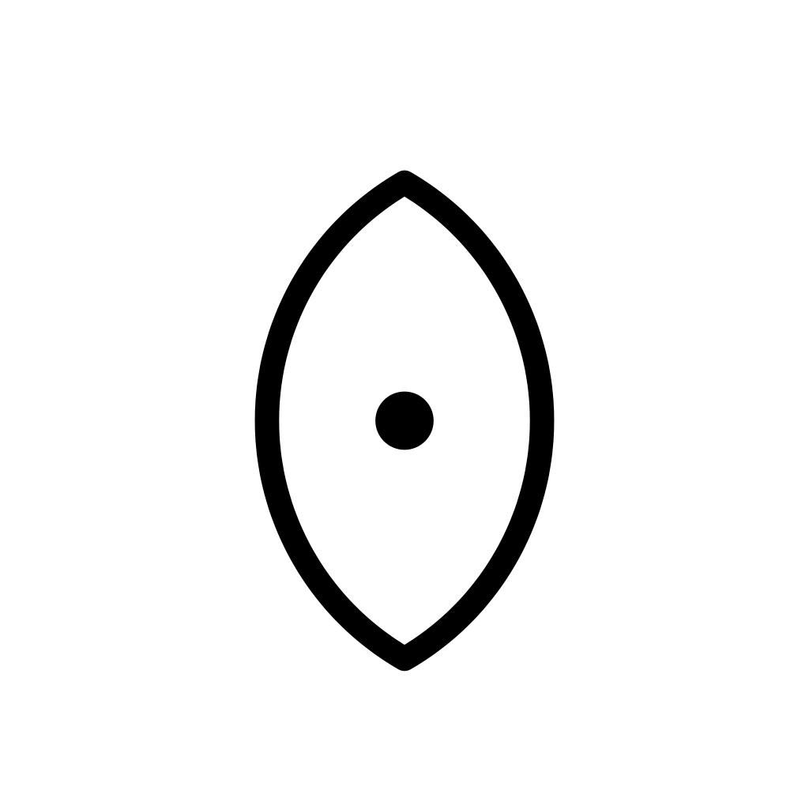

*A mandorla with a dot at its center.*

Someone, or something, waits at the edge of your life. LIMYR is the boundary that is also an invitation, the doorway where contact could begin.

**In shadow**, the doorway is a wall. The boundary stays closed out of fear, and no one crosses in either direction.

*To sit with:* Who or what is waiting at my threshold? Is my boundary a door or a wall?

*Pairs to try:*

- **DISTEN, the Abyss.** The door and the distance behind it. Before you cross, see how far apart you really are.
- **HULMEN, the Veil.** The other is still unknown and partly hidden. Respect what has not been shown yet.
- **SONAL, the Resonance.** The first and last steps of the row. A first meeting that already holds the promise of harmony.

#### R2 DISTEN, the Abyss

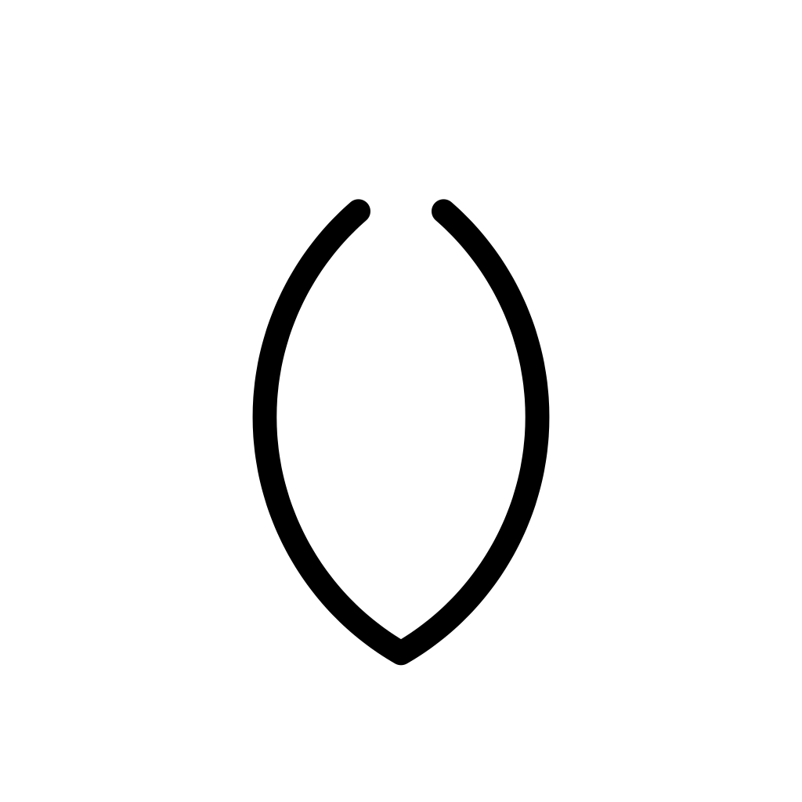

*A mandorla with a gap at the top.*

You suddenly see how far apart you and another really are. It can be painful, but it is also the moment an honest relationship can begin, one that respects the difference.

**In shadow**, the distance hardens into separation, and no one tries to build a bridge.

*To sit with:* What difference between us have I avoided seeing? Is this distance something to respect, or a wound to tend?

*Pairs to try:*

- **PARTEN, the Fragment.** Distance in a relationship and a piece leaving the whole. Is someone stepping away in order to become themselves?
- **MIREN, the Mirror.** What separates you may be exactly what you share.
- **JEKTA, the Leap.** The abyss and the jump across it. Is the leap toward the other, or away?

#### R3 MIREN, the Mirror

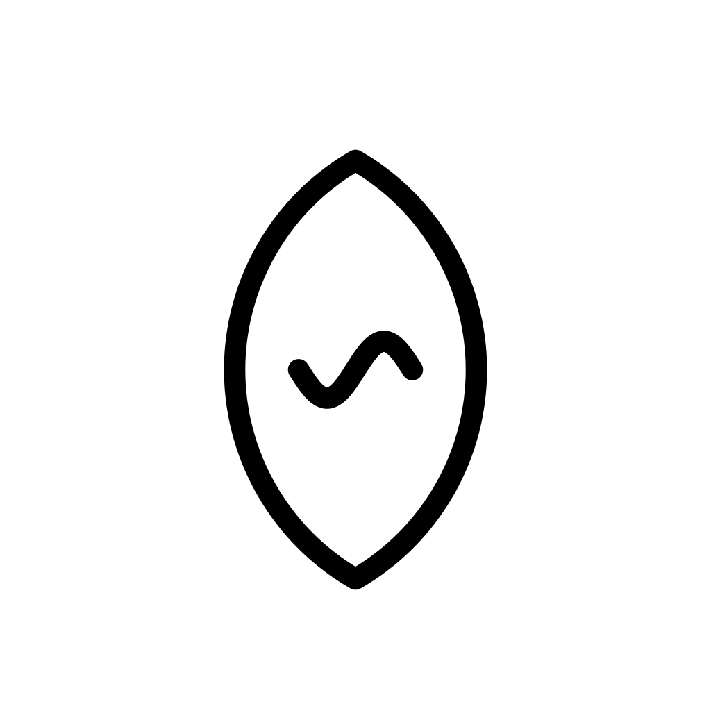

*A mandorla with a wavy line inside.*

You recognize something of yourself in someone else. What you admire or resent in them is quietly showing you a part of your own heart.

**In shadow**, the mirror is blind. We place on the other what is ours, and fight it there.

*To sit with:* What do I see in them that also lives in me? What am I refusing to recognize as mine?

*Pairs to try:*

- **OKULAR, the Witness.** First you see yourself in another, then you see without judging. The mirror slowly clears.
- **IKNOR, the Trace.** What others reflect back to you is a clue to follow, not a verdict.
- **HULMEN, the Veil.** The mirror and what you refuse to see in it. Look closely at what you resent.

#### R4 THEKNA, the Knot

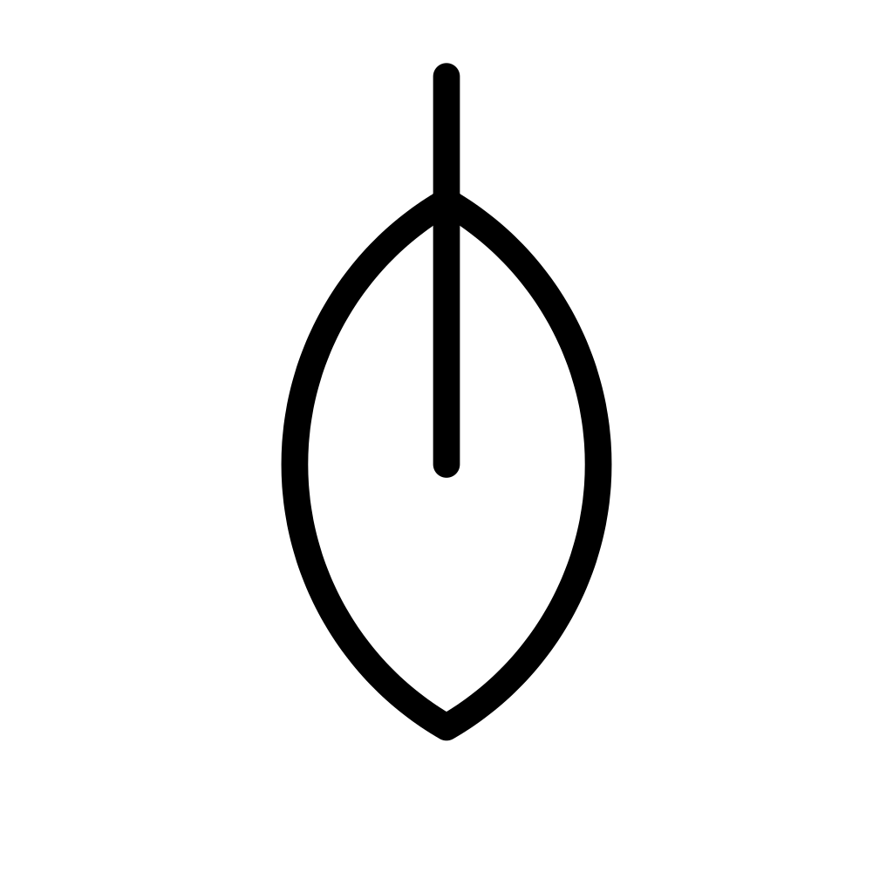

*A mandorla with a line rising from its center and out through the top.*

A bond is being spoken aloud. A promise, a partnership, a choice to belong: commitment made visible.

**In shadow**, the knot tightens into a trap. Dependence, or an obligation kept only out of fear.

*To sit with:* What bond am I being asked to declare or to honor? Does this knot hold me together, or hold me back?

*Pairs to try:*

- **NEXAL, the Fulcrum.** A declared bond and a balance still being found. Commitment does not end the adjusting.
- **VEKTOR, the Path.** A bond and a direction, both made visible. Are you walking the same way?
- **WEVAN, the Weave.** One knot, or a whole net of ties? Notice how many bonds this one touches.

#### R5 SONAL, the Resonance

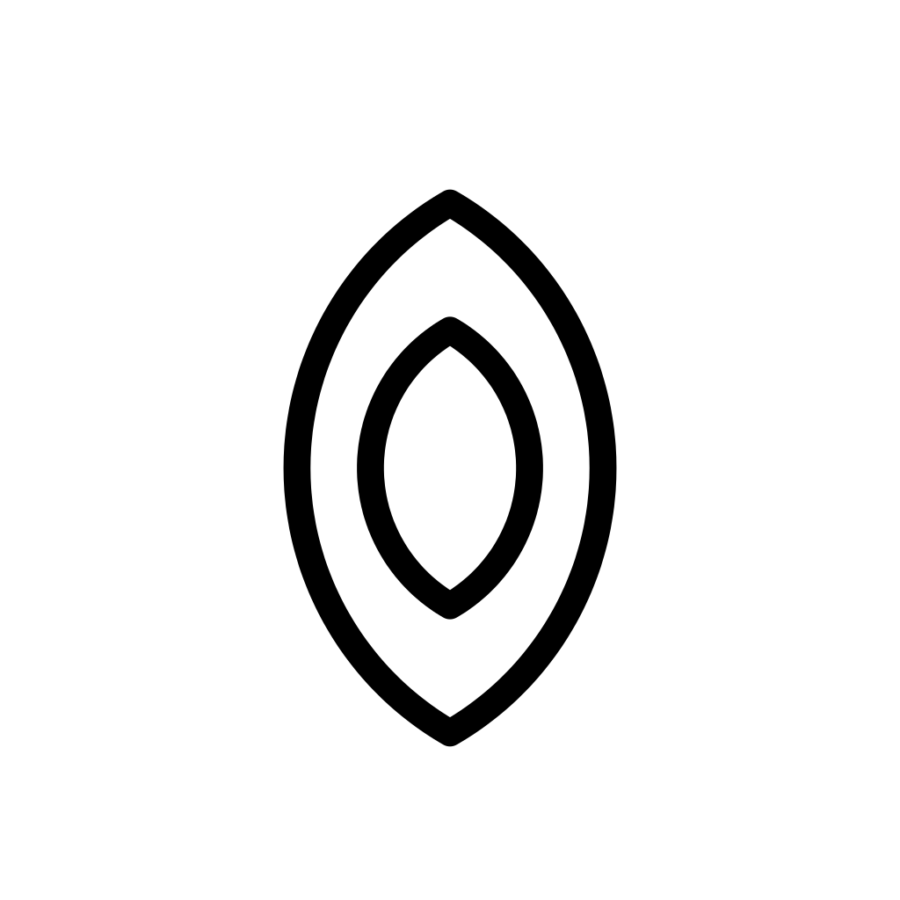

*Two mandorlas, one inside the other.*

Two voices have found their harmony. Each is still fully itself, and together they make something neither could alone.

**In shadow**, harmony becomes fusion, and one voice is lost in the other.

*To sit with:* Where are we truly in tune? Where have I stopped singing my own part?

*Pairs to try:*

- **FLUEN, the Current.** Moving together without effort, or, in shadow, drifting into each other until no one steers.
- **OKULAR, the Witness.** Being fully present to another without losing your own eyes.
- **DISTEN, the Abyss.** Harmony needs difference. Remember the distance that makes two voices, not one.

### Movement: the triangle

The third row follows action, from gathered strength to a journey that comes home.

#### M1 RADHEN, the Root

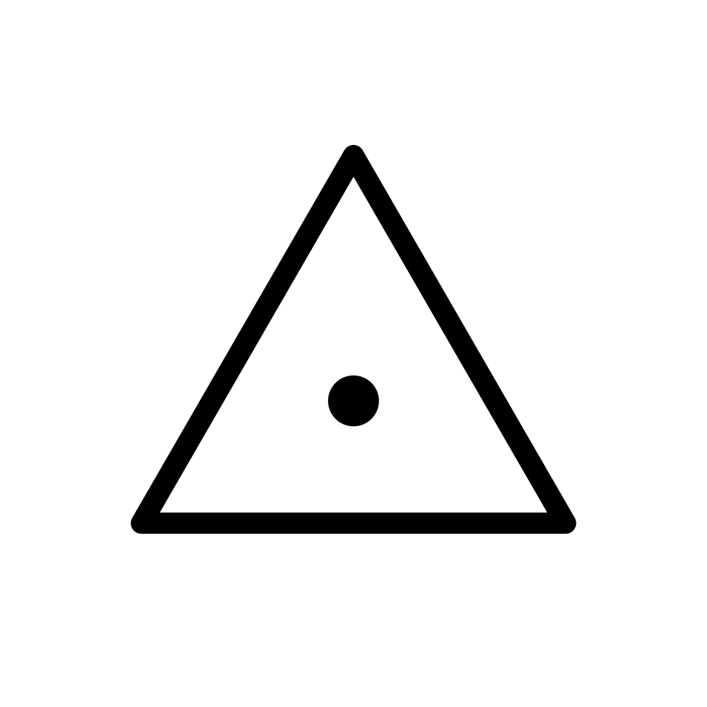

*A triangle with a dot at its center.*

You are gathering strength by staying still. This is chosen stability, the kind that lets a tree stand through a storm.

**In shadow**, the stillness is imposed or stubborn. Rigidity, unable to move even when it is time.

*To sit with:* Is my stillness a choice? What is my root feeding?

*Pairs to try:*

- **FLUEN, the Current.** Staying and flowing. Which one does this moment ask of you?
- **NEXAL, the Fulcrum.** Stillness and balance. A steady base, or a place where you are stuck.
- **XUNDA, the Overflow.** Gathered energy close to bursting. How long can the root hold what is growing?

#### M2 JEKTA, the Leap

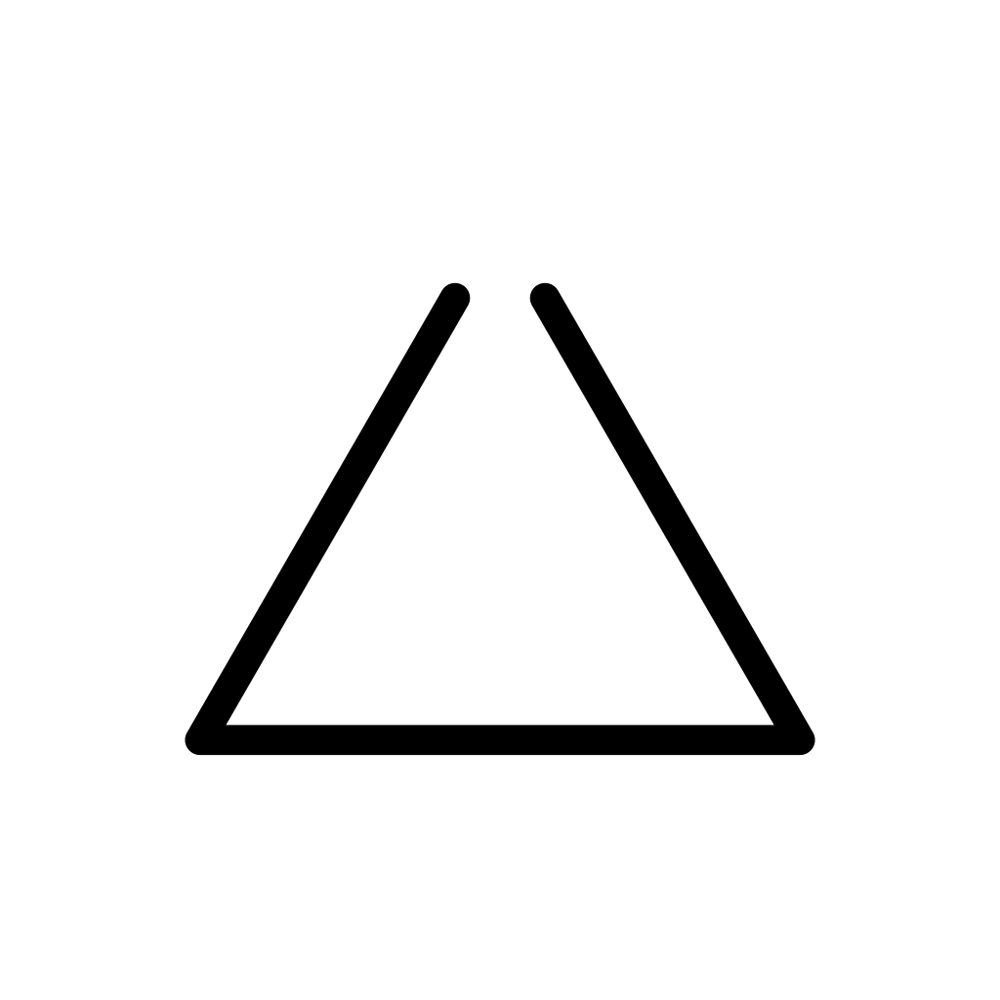

*A triangle with a gap at its point.*

You are breaking from the expected path. A risk taken with open eyes, a jump toward something new.

**In shadow**, the leap is an escape. Impulsiveness, jumping away from something rather than toward anything.

*To sit with:* What leap am I considering? Am I jumping toward something, or away from something?

*Pairs to try:*

- **VEKTOR, the Path.** Leaving the road and choosing a new one. A leap needs somewhere to land.
- **XUNDA, the Overflow.** The jump may be energy that simply cannot be held any longer.
- **LIMYR, the Threshold.** A leap across a boundary, toward contact with someone new.

#### M3 FLUEN, the Current

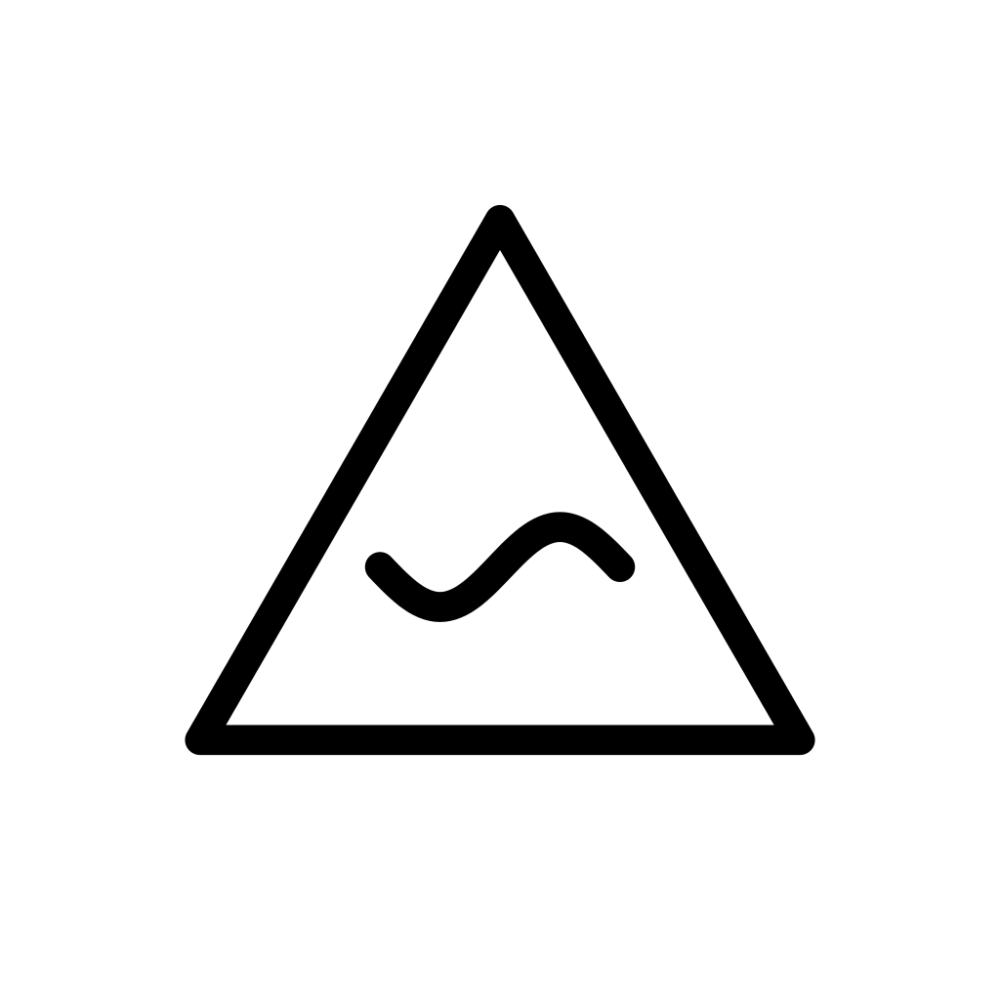

*A triangle with a wavy line inside.*

You are moving with the forces around you instead of fighting them. Flow, adaptation, the wisdom of the river.

**In shadow**, flowing becomes drifting. We let ourselves be carried and call it acceptance.

*To sit with:* Which forces am I moving with? Where would I end up if I never steered?

*Pairs to try:*

- **IKNOR, the Trace.** Following the current and following the signs. Trust the small clues about where things are going.
- **UMVEL, the Chrysalis.** Two kinds of process: movement on the outside, change on the inside.
- **VEKTOR, the Path.** Flow and steering. When to let go, and when to take the rudder.

#### M4 VEKTOR, the Path

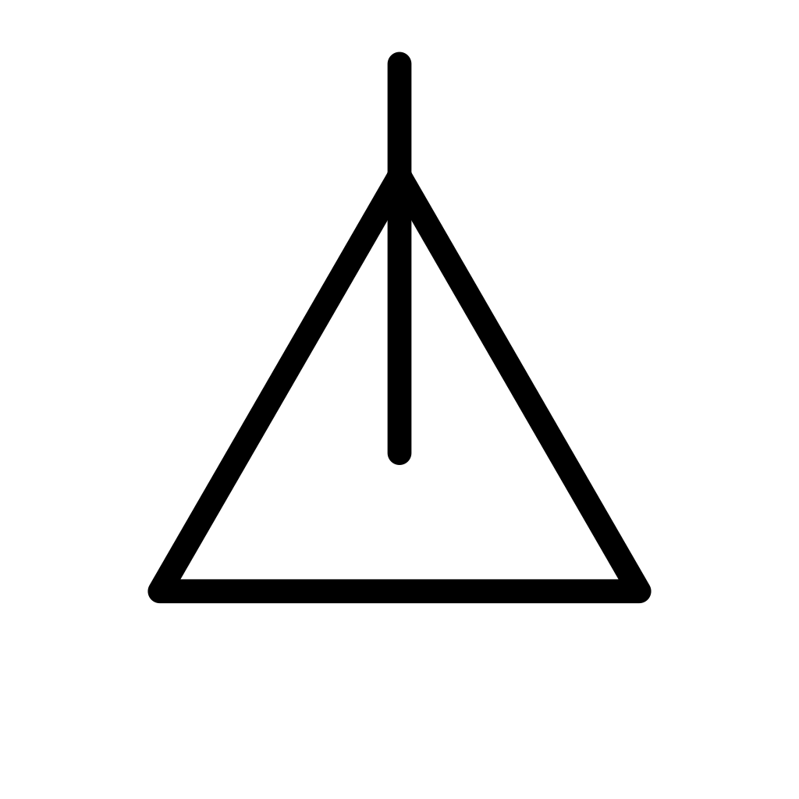

*A triangle with a line rising from its center and out through the point.*

You know where you are going. A chosen direction, steady progress toward something that matters to you.

**In shadow**, the path becomes a rut. We cannot turn aside even when the road has stopped making sense.

*To sit with:* Where am I really going? When did I last check the direction?

*Pairs to try:*

- **KLAVEN, the Key.** Knowing and going. A clear direction that follows an insight.
- **RADHEN, the Root.** The starting point and the route. Does your path still draw strength from where you began?
- **CYRKEL, the Return.** A path that turns out to lead home.

#### M5 CYRKEL, the Return

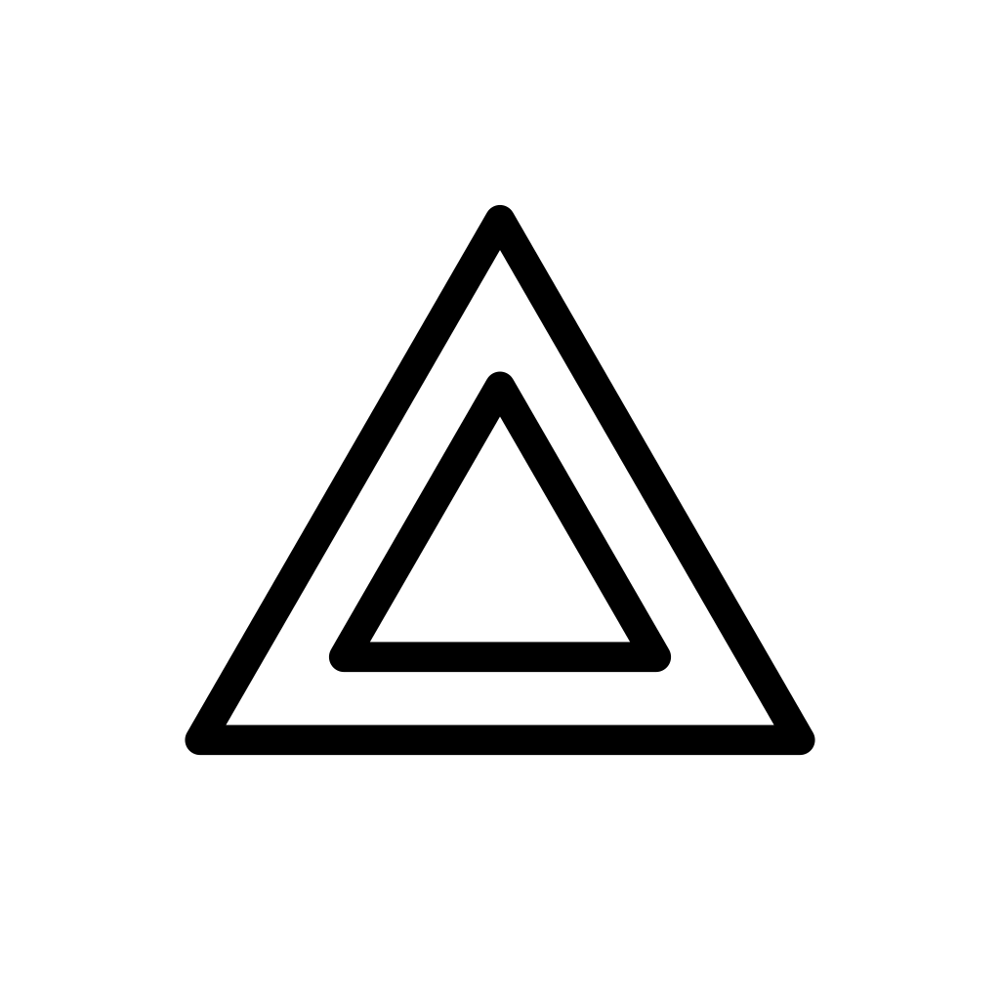

*Two triangles, one inside the other.*

A journey closes by coming home. You return to where you began, but you are not the same person who left.

**In shadow**, the return is just a circle. We come back to the same place again and again, without learning.

*To sit with:* What am I returning to? What am I bringing back that I did not have when I left?

*Pairs to try:*

- **ASKOR, the Ash.** A cycle has closed, and its ending is leading you back to where you belong.
- **QUERIK, the Labyrinth.** Coming home, or walking in circles? The two can look alike from inside.
- **MIREN, the Mirror.** Returning to an earlier self, and meeting it as someone you can now recognize.

### Knowledge: the narrow rhombus

The fourth row follows understanding, from what is veiled to what is simply, clearly seen.

#### K1 HULMEN, the Veil

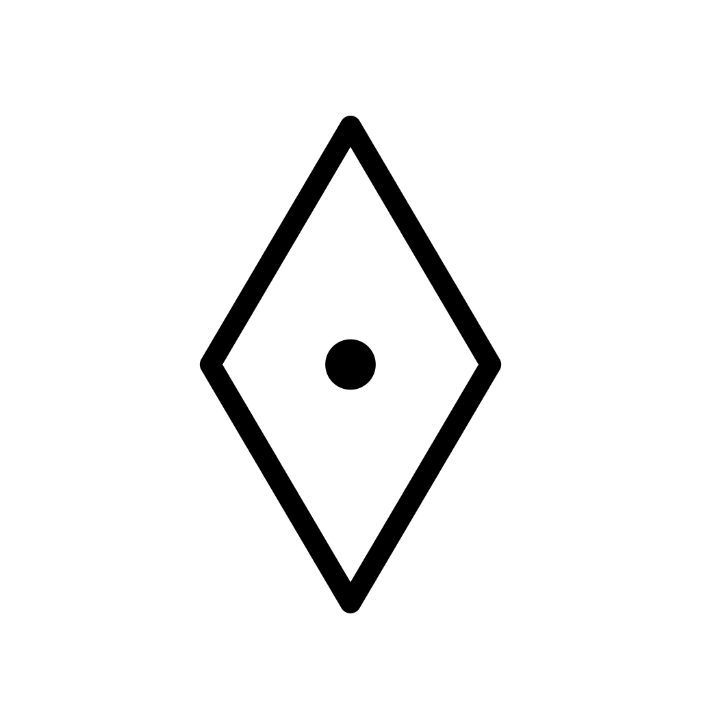

*A rhombus with a dot at its center.*

Something is hidden, and perhaps rightly so. Not everything needs to be known yet. Some mysteries protect us until we are ready.

**In shadow**, the veil becomes denial. It stays in place because we do not want to see what is behind it.

*To sit with:* What am I not ready to know yet? What am I refusing to see?

*Pairs to try:*

- **UMVEL, the Chrysalis.** Hidden work beneath a hidden surface. Let it ripen before you look.
- **KLAVEN, the Key.** The veil and what lifts it. Is now the time to know?
- **ZERAN, the Void.** Something hidden, or nothing there yet? Sometimes the veil covers an empty, waiting space.

#### K2 QUERIK, the Labyrinth

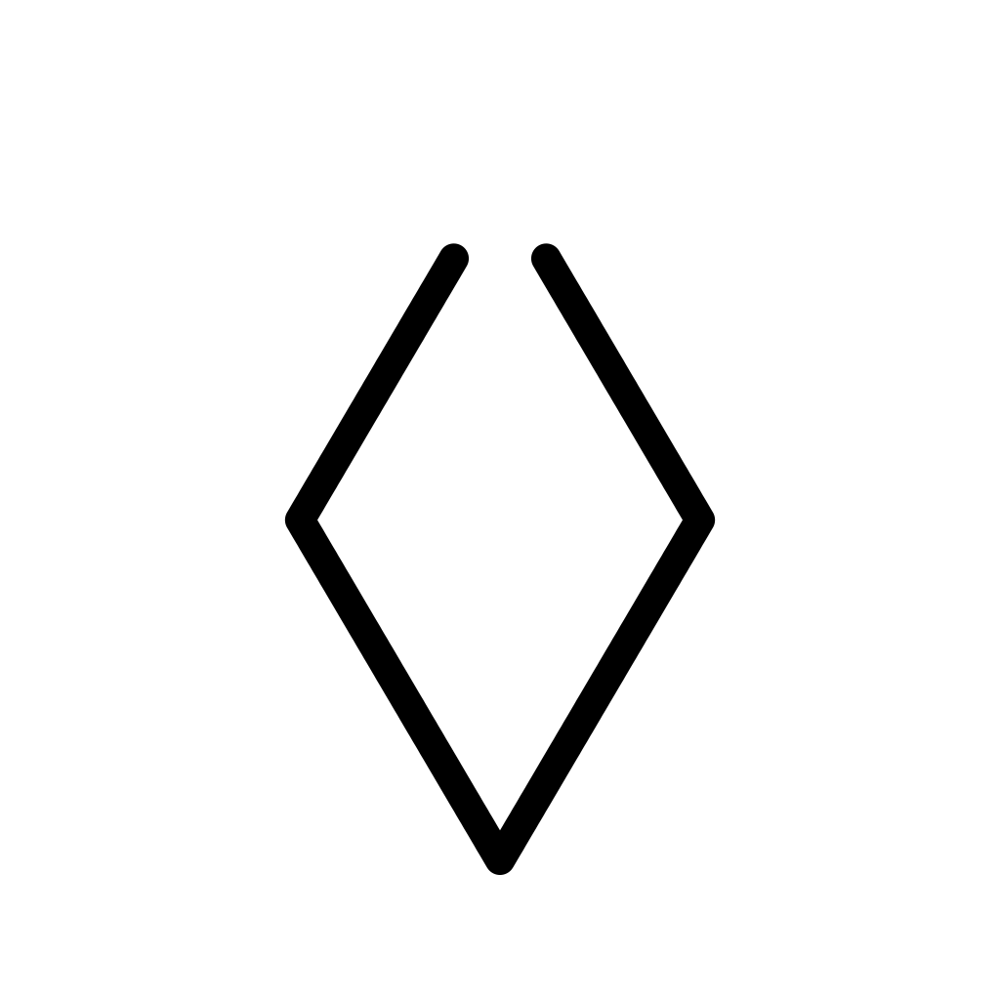

*A rhombus with a gap at the top.*

The old map no longer works, and you feel lost. Strangely, this is a gift: only when we are lost do we really start to search.

**In shadow**, the search goes round in circles. We keep looking so that we never have to find.

*To sit with:* What question am I really lost in? Is this search leading anywhere?

*Pairs to try:*

- **BREKA, the Fracture.** The map and the self breaking together. You are lost because you are changing.
- **IKNOR, the Trace.** The way through a labyrinth is one clue at a time.
- **PARTEN, the Fragment.** Feeling lost because a part of you, or of your life, has come loose.

#### K3 IKNOR, the Trace

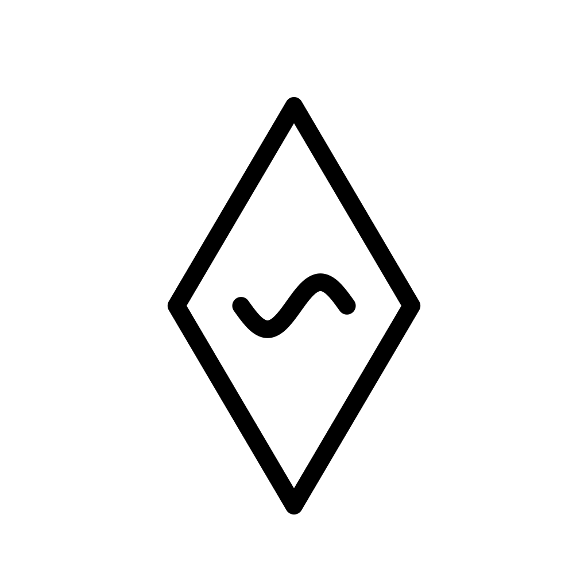

*A rhombus with a wavy line inside.*

You are piecing something together from its signs, the way a tracker reads footprints. Understanding that comes slowly, through clues and effects.

**In shadow**, the traces are false. Guesswork and hearsay taken for knowledge.

*To sit with:* What signs have I noticed but not followed? Which of my certainties are second-hand?

*Pairs to try:*

- **FLUEN, the Current.** Clues about which way things are already flowing.
- **MIREN, the Mirror.** What others reflect back to you may be the clearest trace you have.
- **KLAVEN, the Key.** Clues close to turning into insight. Keep following; the door is near.

#### K4 KLAVEN, the Key

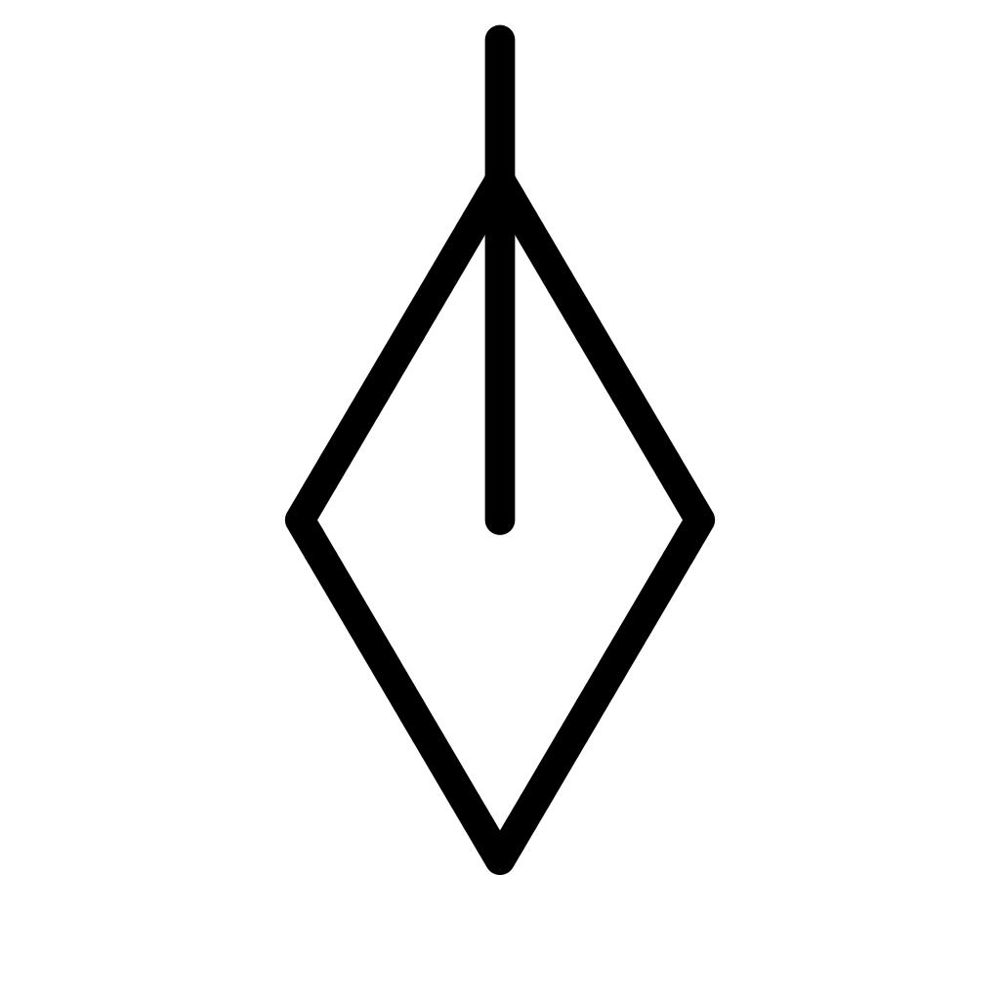

*A rhombus with a line rising from its center and out through the point.*

Something becomes clear, and a door opens. The moment of insight, when what was locked suddenly turns.

**In shadow**, we believe we have understood everything, and we try to force one key into every lock.

*To sit with:* What do I understand now that I did not before? Which door is this key not made for?

*Pairs to try:*

- **EMRAL, the Emergence.** Understanding that lets you step into the light.
- **LIMYR, the Threshold.** A key and a door. Insight that makes contact possible.
- **QUERIK, the Labyrinth.** The way out of the maze, or, in shadow, one key forced into every lock.

#### K5 OKULAR, the Witness

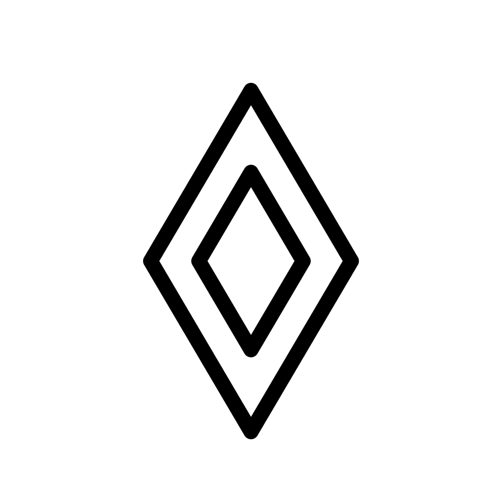

*Two rhombuses, one inside the other.*

You can see clearly and without judgment. A calm, complete gaze, simply present to what is.

**In shadow**, the witness becomes a spectator, watching from a safe distance and never taking part.

*To sit with:* What can I see now without judging it? Where have I become only an onlooker?

*Pairs to try:*

- **HULMEN, the Veil.** The whole row in two glyphs: from what is hidden to what is simply seen.
- **NEXAL, the Fulcrum.** Seeing clearly what you are balancing, without rushing to tip the scales.
- **SONAL, the Resonance.** Calm presence with another, or, in shadow, watching a relationship from outside.

### Integration: the square

The fifth row follows how the parts of a life fit together, from an empty space to a woven fabric.

#### I1 ZERAN, the Void

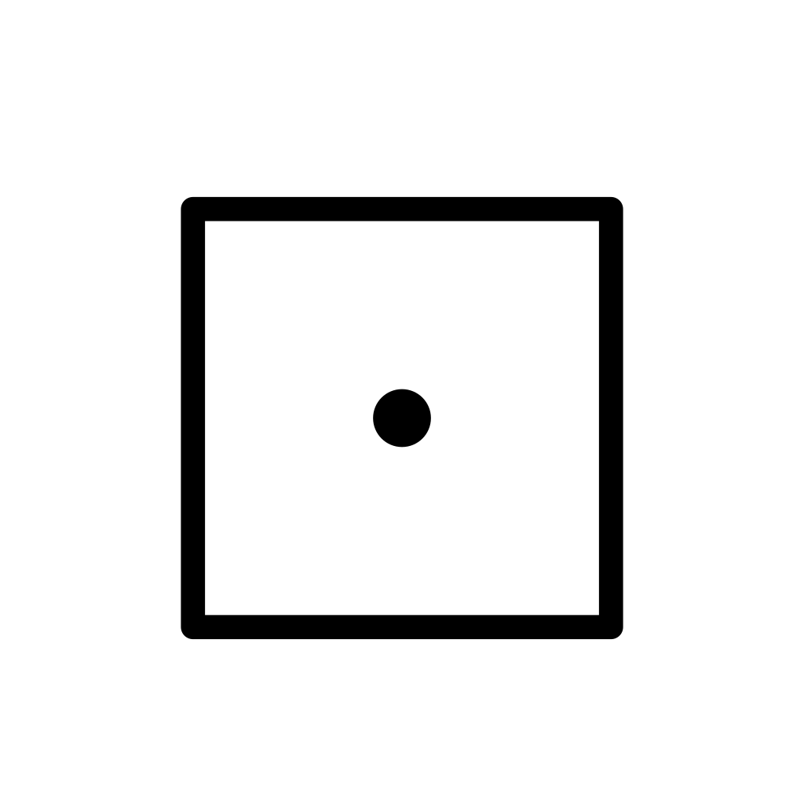

*A square with a dot at its center.*

A space has opened in your life. It may feel like absence, but it is also room: room for something that is not here yet.

**In shadow**, the space is felt only as loss, as something missing.

*To sit with:* What space has opened in my life? Am I filling it too quickly, or not at all?

*Pairs to try:*

- **GERMA, the Seed.** Empty ground and a seed. The space is ready for something to begin.
- **HULMEN, the Veil.** Is the space really empty, or is something there that you cannot see yet?
- **XUNDA, the Overflow.** The empty container and the full one. Room to receive, or a lack you are tempted to fill too fast.

#### I2 PARTEN, the Fragment

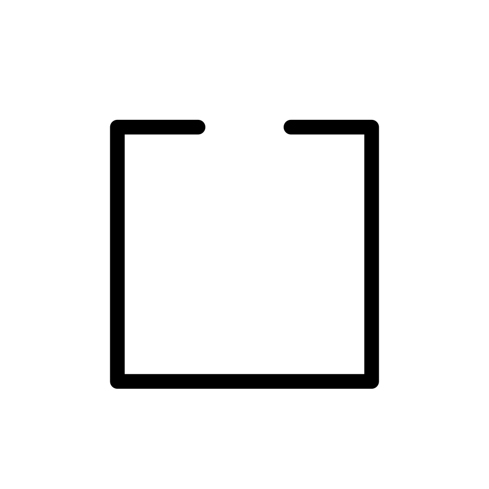

*A square with a gap at the top.*

A piece is separating from the whole, finding its own shape. Sometimes a part has to step away to become fully itself.

**In shadow**, the piece is simply lost. Fragmentation, a part that no longer belongs anywhere.

*To sit with:* What part is separating from the whole? Is it becoming itself, or getting lost?

*Pairs to try:*

- **DISTEN, the Abyss.** A part separating and a distance opening. The same movement seen in structure and in relationship.
- **QUERIK, the Labyrinth.** A loose piece and a lost map. Disorientation may come from what has broken away.
- **WEVAN, the Weave.** The fragment and the fabric. Will this piece find its place in a new whole?

#### I3 NEXAL, the Fulcrum

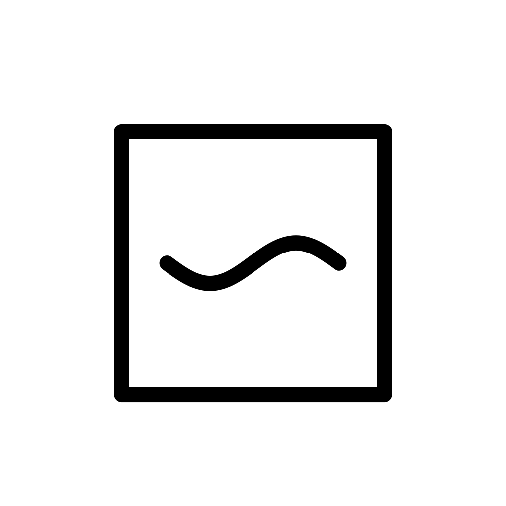

*A square with a wavy line inside.*

Forces are swaying around a center, slowly finding their balance. The quiet, ongoing work of holding things together.

**In shadow**, the balance becomes paralysis, so careful that no choice can ever be made.

*To sit with:* Which forces am I balancing? Does this balance help me act, or keep me from acting?

*Pairs to try:*

- **RADHEN, the Root.** A firm base for the balance, or two ways of not moving at all.
- **THEKNA, the Knot.** A bond already declared, still finding its balance day by day.
- **OKULAR, the Witness.** Watching the scales calmly before you decide anything.

#### I4 XUNDA, the Overflow

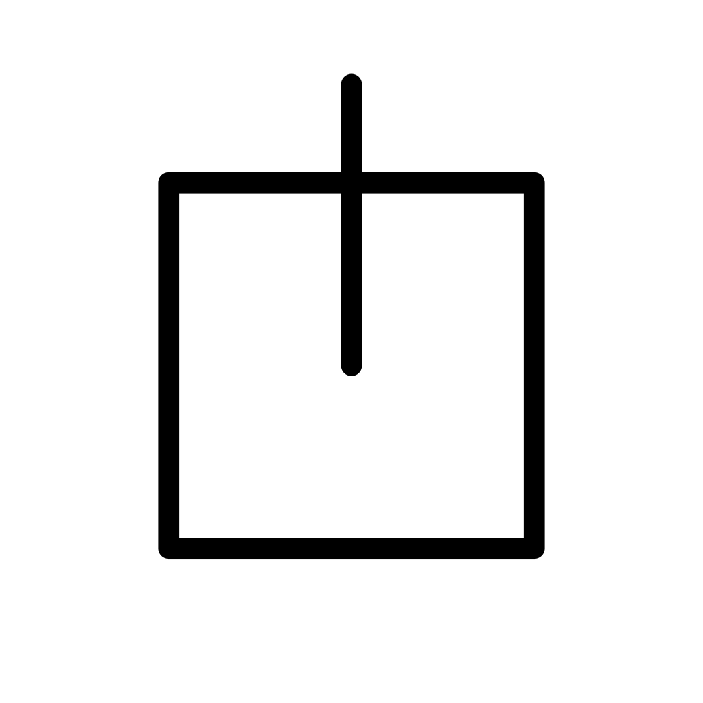

*A square with a line rising from its center and out through the top.*

There is more in you than the container can hold, and it wants to come out. Abundance looking for expression.

**In shadow**, the overflow breaks its banks. Too much, too fast, and something is damaged.

*To sit with:* What is overflowing in me? Where can it go without breaking what holds it?

*Pairs to try:*

- **RADHEN, the Root.** Energy held for a long time is finally spilling over.
- **JEKTA, the Leap.** The overflow becomes a jump. Make sure it lands somewhere good.
- **ZERAN, the Void.** Fullness looking for empty space. Where could this abundance be welcome?

#### I5 WEVAN, the Weave

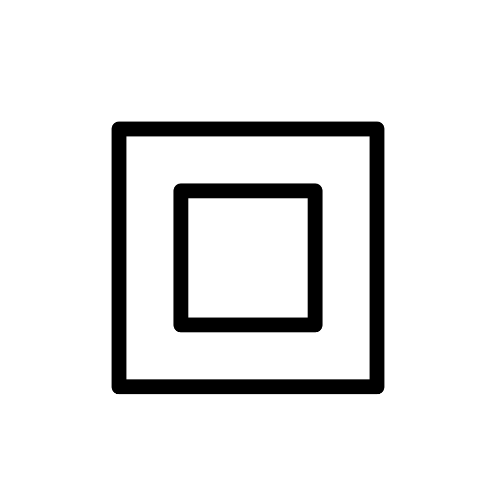

*Two squares, one inside the other.*

Many threads have come together into one fabric. The different parts of your life are holding one another.

**In shadow**, the weave becomes a net, a complexity you can no longer manage or leave.

*To sit with:* What threads have come together? Does this fabric hold me up, or hold me in?

*Pairs to try:*

- **THEKNA, the Knot.** One bond within a larger fabric. See how it holds the others, or pulls them tight.
- **ASKOR, the Ash.** Endings woven into the whole. What is finished has become part of what holds you.
- **PARTEN, the Fragment.** A thread coming loose from the fabric. Let it go, or weave it back in?

# Part Three: Method

## Chapter 8: Preparing a Consultation

A good reading begins a little before the draw. You need only three things: a way to choose glyphs at random, an open question, and a few quiet minutes with a pen and paper.

### Your glyphs

Any set will do, as long as it lets you draw at random **without putting glyphs back**: once a glyph appears, it cannot appear again in the same reading.

The loveliest option is a set of twenty-five **tiles in a small bag**. You reach in without looking and let your fingers choose. The tiles should feel identical from the back, so touch gives nothing away. A deck of twenty-five **cards** works just as well: shuffle, and take from the top. Blank cards with an opaque back are easy to turn into a SYNOPTRA deck.

If you have no set with you, **two ordinary six-sided dice** will do, the kind found in any board game box. Choose two of different colors if you can: one die gives the row (1 Transformation, 2 Relation, 3 Movement, 4 Knowledge, 5 Integration) and the other gives the phase, from 1 to 5. Whenever a die shows a 6, simply roll that die again. If the glyph has already come up in this reading, roll both again. Rolling this way has a quiet charm of its own, because every throw reminds you that each glyph is a meeting of two directions. And if you are away from home, any **random number app** can pick numbers from 1 to 25 without repeats, if you number the glyphs row by row, from GERMA as 1 to WEVAN as 25.

### Making your own set

Many people love having a set they made themselves, and SYNOPTRA makes it easy. You only need to draw five shapes and five marks, following the tips in Chapter 5. Slices of wood, clay tiles, smooth stones and thick card all work beautifully. Keep the backs plain and alike, and keep the lines thin and dark on a light surface.

A handmade set is not more powerful. It is simply more familiar, and familiarity helps the glyphs become your own.

### No upside down

SYNOPTRA glyphs have no reversed position. Several of them look the same either way up, and orientation never decides their meaning. Whether a glyph shows you its light or its shadow is something you decide, guided by your question and by the glyph's place in the spread. This is on purpose: it keeps the heart of the reading in your hands.

### Finding your question

Your question is the lens through which you will see every glyph. A clear, open question can make even a single glyph speak; a closed one can silence a whole spread.

**Ask open questions.** SYNOPTRA cannot answer yes or no, and it cannot tell you what will happen. What it does beautifully is help you see a situation from new sides. Good questions often begin with *what* or *how*. Instead of asking "Will I get the job?", you might ask "What do I need to understand about this job search?" Instead of "Does she love me?", try "What is happening between us right now?" Instead of "Should I move to Berlin?", ask "What is drawing me toward this move, and what is holding me back?"

**Ask about yourself.** You can ask about a relationship or a group, but the reading always speaks to your side of it: what you see, what you feel, what you can do. The glyphs cannot read another person's mind, and they should never be used to guess at it.

**Keep it to one thing.** A question about your whole life gives the glyphs too much room. Choose one situation, one decision, or one relationship.

**Write it down.** Before you draw, write your question at the top of a fresh page, with the date. Later, when you come back to your notes, you will be glad you did.

### Making a little space

No ritual is required. What helps is attention. Choose a moment when you will not be interrupted for fifteen or twenty minutes. Put your phone in another room. Take a breath or two, and hold your question gently in mind before you draw.

If you enjoy a small ritual, such as lighting a candle, making a cup of tea, or always sitting in the same chair, by all means keep it. Its gift is that it tells you: *now I am paying attention*. It needs no other power.

### When to wait

There are a few moments when it is better not to read. When a decision has to be made in the next few minutes, the reading will only add pressure. When a question really needs facts, such as a medical, legal or financial matter, the glyphs are the wrong tool. And when you notice yourself drawing again and again on the same question, hoping for a different answer, it is time to put the bag away. That habit turns a tool for seeing into a way of not seeing. We will talk about this kindly in Chapter 13.

## Chapter 9: How to Read

Every SYNOPTRA reading, whatever the spread, follows the same gentle rhythm. You look before you look anything up. You weigh both faces of a glyph before you choose. And you take in the whole picture before you trace the threads between the glyphs.

1. **Find your question**, open and clear, and write it down.
2. **Draw your glyphs** and lay them in the positions of your spread, without checking their meanings yet.
3. **Look at each shape** and write down your very first reaction.
4. **Weigh light and shadow** for each glyph, and decide which face is showing.
5. **Look at the grid of your spread**: which rows and phases appear, which repeat, which are missing.
6. **Read the glyphs together**, write a sentence that gathers them, and choose one small action.

Let us walk through the steps that ask for a little more care.

### Your first reaction

This is the step people are most tempted to skip, and it is the one that makes SYNOPTRA a mirror rather than a dictionary. Before you think "that is EMRAL, the Emergence", simply look at the drawing. What does it make you feel? What does it remind you of? A line breaking out of a circle might suggest an escape, a birth, a flash of anger, a flower opening. Write it down in a few words, however strange it seems.

That first reaction matters because it comes before the book can steer you. Very often, the most useful moment of a reading lives in the gap between what you first saw and what the glyph is "supposed" to mean.

### Light or shadow?

Every glyph has a helpful face and a difficult one. Choosing between them is the heart of the reading, and no rule can make that choice for you. A few gentle guides can help, though.

Notice which face you would rather not consider. If you brush the shadow aside quickly, stay with it a moment longer. Resistance is often a sign that something fits. Remember, too, that both faces can be present at once. A root can hold you up and hold you down at the same time, and saying so is a perfectly good reading. Let the position help you: in the Quincunx, a glyph in the place of "what holds you back" leans naturally toward its shadow. And if every glyph seems dark, or every glyph seems bright, pause and ask whether you are reading your situation or simply your mood today.

### Seeing the shape of the spread

When you draw three or more glyphs, the grid offers you a second layer of insight that no single glyph can give. Write down their codes and look at the pattern.

If the **same row** appears more than once, your situation is living mostly in that area of life. Three Relation glyphs, for instance, say that this is above all about a relationship. If the **same phase** repeats, your situation is gathered around that moment of change: three Crisis glyphs suggest something breaking open on several levels at once.

What is **missing** can speak just as clearly. A reading about a family decision with no Relation glyph might gently ask: where are the others in this? A spread with no Process glyph might ask whether you are hoping to jump from crisis straight to resolution, skipping the quiet inner work in between.

Watch, too, for **phases far apart**. Ash beside Root, for example, can show a cycle closing while the next movement is still only gathering strength. And when **every row and every phase** appears, your situation is touching the whole of your life, each part at a different stage.

The visual grammar makes all this easy to see. Glyphs of the same phase share the same mark, so a repeated phase will catch your eye on the table before you even name it.

### Reading the glyphs together

Now let the glyphs speak to each other in their positions. Does one seem to cause or feed another? Do two of them pull in opposite directions? If you took one glyph away, which would change the picture most?

Then gather everything into a single sentence, in your own words. Let it speak about your life, not about the glyphs. "MIREN in the center and HULMEN below" is only a description. "I keep seeing my own fear in my brother, and I haven't admitted how much it frightens me" is a reading.

### After the reading

Close with one small, concrete step: something to notice, to ask, or to do in the coming days. A reading that ends in a gentle action usually serves you better than one that ends in a mood. Then close your notebook and let it rest. Chapter 12 will show you how to come back to it.

## Chapter 10: The Spreads

SYNOPTRA has three spreads to start with: one glyph, three glyphs and five. And it has one simple rule for inventing your own: every position must have its meaning decided before you draw.

### A single glyph

One glyph, no positions. This is the simplest reading of all, and the best way to make friends with the glyphs. It takes about five minutes.

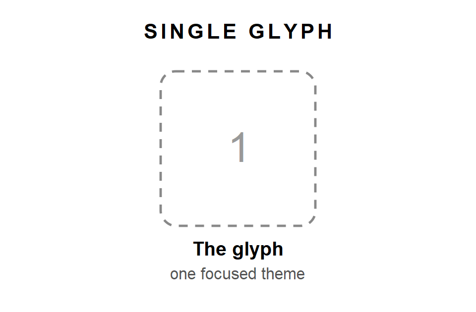

Use it with a focused question, such as "What should I pay attention to in today's conversation?", or as a morning companion: "What is stirring in me today?" Look at the shape, write your first reaction, read both faces, and choose. With no grid to look at, give the extra time to the two questions in the glyph's portrait.

If you draw one glyph each morning for a month, you will meet most of the twenty-five in the middle of your real life. There is no better way to learn them.

### The Triad

Three glyphs in a row, read from left to right. It takes about fifteen minutes. The Triad comes in two forms, and you choose one before you draw.

The **Time Triad** is for a situation that is unfolding. The left glyph shows the **past**, what led you here. The center shows the **present**, what is active now. The right shows the **tendency**, where things are heading if nothing changes. That last position is not a prediction. It describes the direction of the present, so that you can change course if you wish.

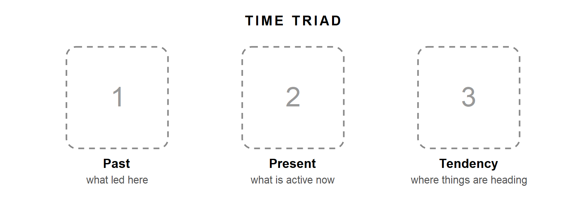

The **Knot Triad** is for a problem you feel stuck in. The left glyph shows the **situation**, what is going on. The center shows the **obstacle**, what is in the way. The right shows the **resource**, what can help. Often the obstacle leans toward its shadow and the resource toward its light, but not always. A resource can hide inside a shadow, such as the stubbornness of RADHEN that may be exactly the persistence you need. And an obstacle can be a good quality you are simply using too much.

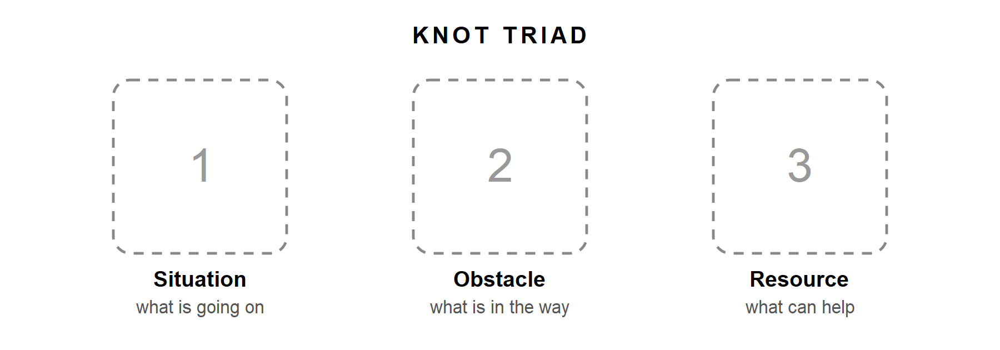

With three glyphs, you can already look at the shape of the spread, as described in Chapter 9: repeated or missing rows and phases.

### The Quincunx

Five glyphs, laid out like the five dots on the face of a die. The Quincunx is the spread for a complex situation, when several forces seem to pull at once. Give it twenty to thirty minutes.

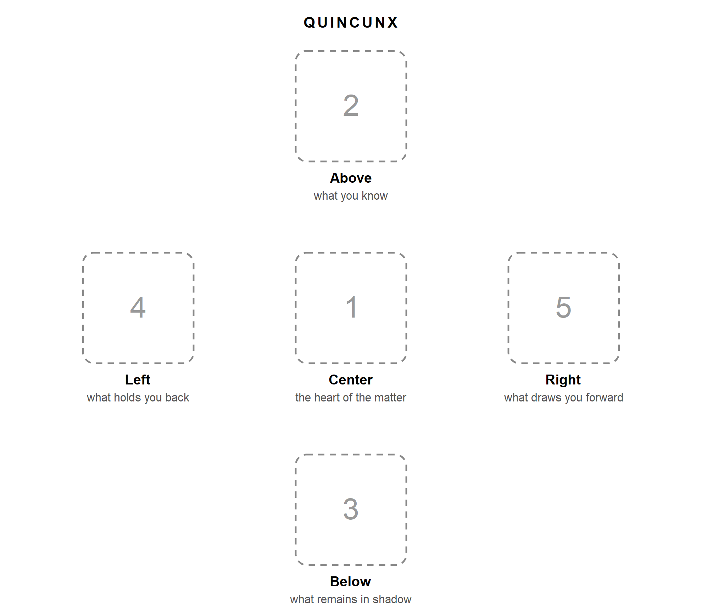

On the table, set the four outer glyphs above, below, left and right of the center, like the five dots of a die turned a little on its corner. The numbers in the picture show the order in which to lay them: center, above, below, left, right. Record them in the same order.

Read the Quincunx along its two lines. The **vertical line**, above and below, sets what you already know beside what you cannot yet see. Give the glyph below the most time; it is the one you are least likely to recognize at first. The **horizontal line**, left and right, shows the forces in tension. Ask whether they are truly opposed, or two faces of the same thing. Then return to the **center**, which everything else surrounds. After all you have seen, does the heart of the matter look different now?

With five glyphs from twenty-five, the shape of the spread becomes rich. Take a careful look at which rows and phases repeat, and which are missing.

### Your own spreads

You are warmly invited to create your own spreads. There is only one rule: **every position must have its meaning decided before you draw.** Deciding what a position means after seeing the glyph quietly turns the reading into a search for what you wanted to hear.

Here are a few ideas to begin with.

**Two Paths** sets two glyphs side by side for two options, and one beneath for what both have in common.

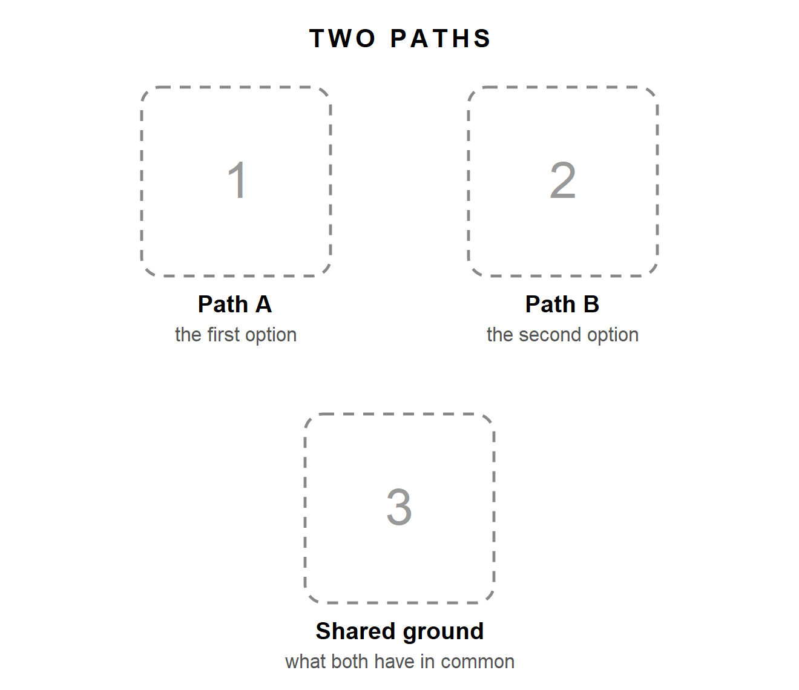

**Five Rooms** gives one glyph to each row of the grid, so you can see where each area of a situation stands in its change. Use the dice, keep the row fixed for each position, and roll only the phase die.

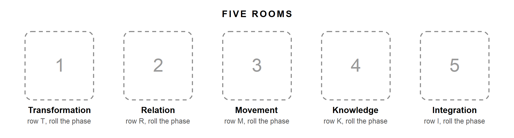

**The Cycle** has five positions, one for each phase, laid out in a circle, so you can read a situation as a journey from its first seed to its completion.

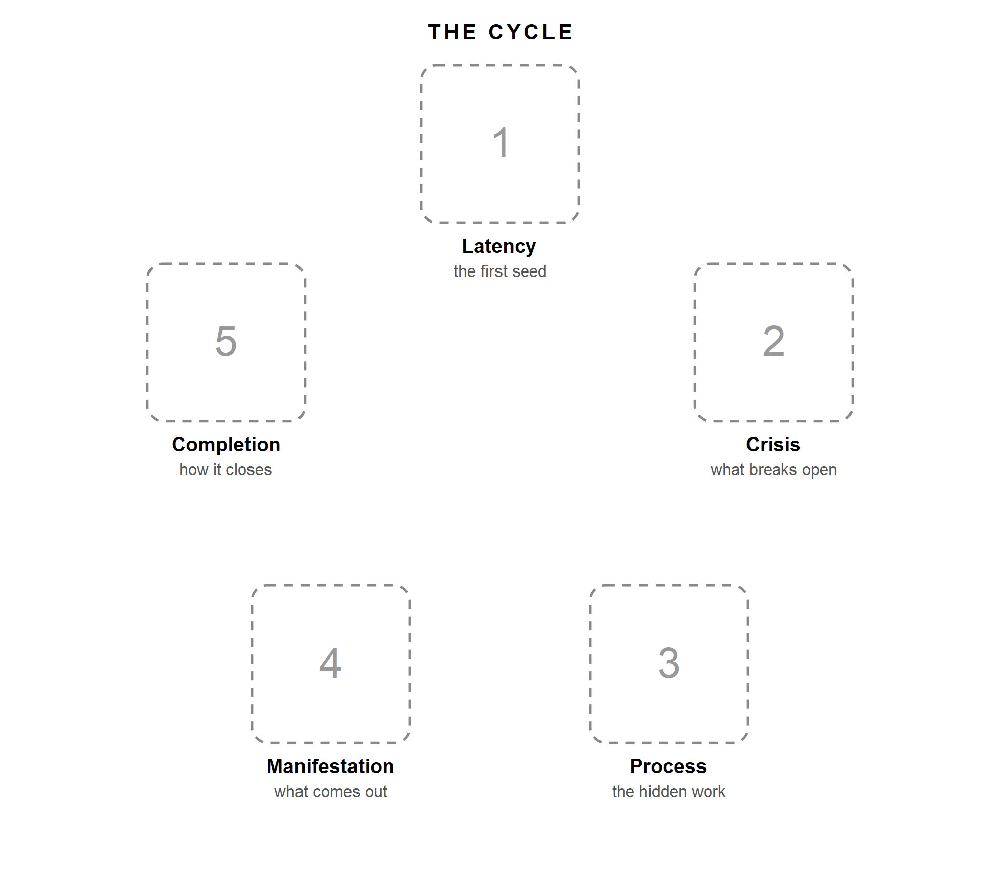

Write your new spread and its positions in your journal before you draw, so you can use it again.

### Writing a reading down

You can record any reading in a single line. With **initials**, in the order you laid the glyphs: `M E H P C` for a Quincunx of MIREN, EMRAL, HULMEN, PARTEN and CYRKEL. Or with **codes**, when you want to see the rows and phases at a glance: `R3 T4 K1 I2 M5`.

For your own spreads, choose a fixed order for the positions and always write them in that order.

## Chapter 11: Sample Readings

Here are four readings: one for each spread, and one that does not land at all. The people and their stories are invented, but every step follows the path from Chapter 9. Please read them as a glimpse of how a reading can unfold, not as the "right" answers. The same glyphs, in your hands and with your question, would say something quite different.

### One glyph: the unfinished course

Giulia has started an online course three times, and three times she has stopped halfway. One evening she sits down with her notebook and writes: *What am I not seeing about why I stop?*

She draws UMVEL, the Chrysalis.

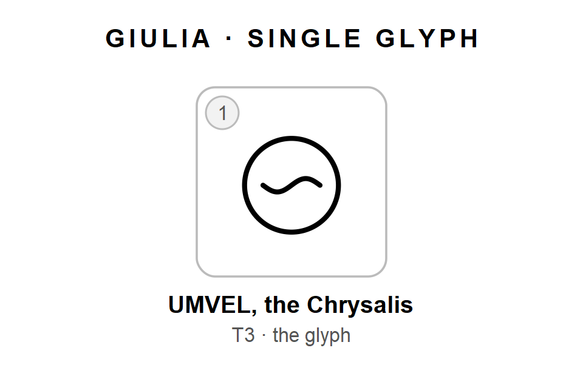

Her first reaction, written before she opens the book: "A cocoon. Something closed. Honestly, it looks like a blanket over my head."

Then she reads the two faces. The light is quiet inner change, a protected incubation. The shadow is a shell, a refusal to come out. Her blanket already leans toward the shadow. But as she reads the light, something else surfaces. Every time she stopped, it was at the same point: when the course asked her to post her work in the group forum.

She writes: "I don't stop because I'm lazy. I stop at the moment I have to show something. The learning happens. The showing is what I avoid."

Her small step: finish the current module, and share one piece of work, even a tiny one, with a single friend she trusts, rather than with the whole forum.

Notice what happened. The glyph knew nothing about the forum. It simply offered an image of something hidden and closed, and that image helped Giulia see a pattern she already had all the pieces for.

### Three glyphs: the partnership

Marco runs a small design studio with an old friend. For months there has been tension between them that neither can quite name. He chooses a Knot Triad and asks: *What is really blocking us?*

In the place of the situation, he draws THEKNA, the Knot. In the place of the obstacle, RADHEN, the Root. In the place of the resource, QUERIK, the Labyrinth.

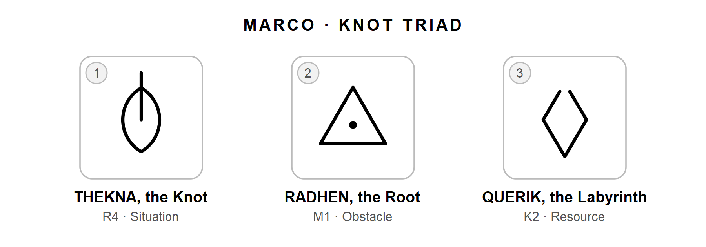

His first reactions are short. The Knot: "A line breaking out of a lens, like something escaping." The Root: "Heavy. Planted." The Labyrinth: "A broken diamond. Annoying, actually."

Weighing the faces, he finds that THEKNA shows both at once: the partnership is a real commitment, and it also feels like a trap. RADHEN shows its shadow clearly: both partners are clinging to the roles they had at the beginning. And QUERIK, to his surprise, shows its light: disorientation that pushes you to search.

Looking at the shape of the spread, he sees three rows (Relation, Movement, Knowledge) and notices that Integration is missing. It strikes him at once. They have never really talked about how the parts of the studio, meaning their roles, fit together now that the business has changed.

He stays longest with the Labyrinth as a resource. The help is not a clear answer. It is admitting that neither of them knows any more how the studio should work, and starting from there instead of defending the old map.

He writes: "We are both rooted in the roles we had five years ago. The knot is real, but we are pulling it tighter by pretending we know where we are going. The way out starts with saying we are lost."

His small step: suggest a meeting with a single topic, what each of them actually does now compared with what they did at the start.

### Five glyphs: the move

Sara has been offered a job abroad. The offer is good, her partner is supportive, and still she cannot decide. She lays out a Quincunx and asks: *What is happening in me around this move?*

At the center, the heart of the matter, she draws MIREN, the Mirror. Above, what she knows: EMRAL, the Emergence. Below, what remains in shadow: HULMEN, the Veil. On the left, what holds her back: PARTEN, the Fragment. On the right, what draws her forward: CYRKEL, the Return. In her journal she writes it as `M E H P C`, or `R3 T4 K1 I2 M5`.

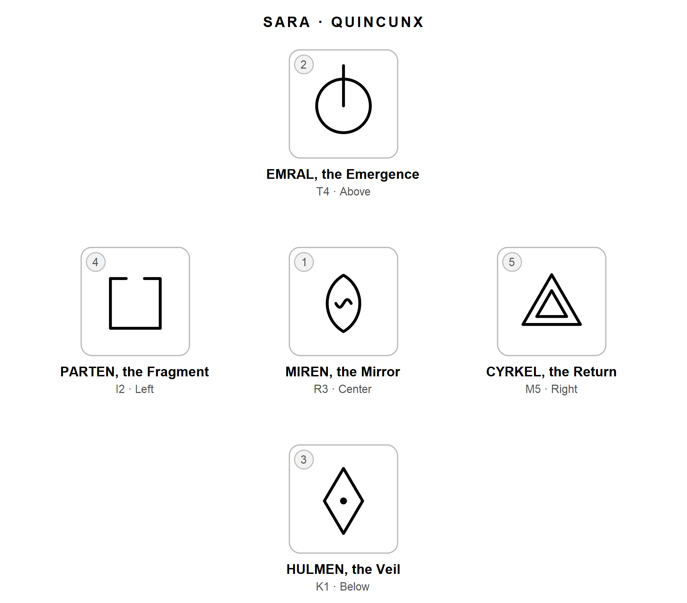

Her first reactions come quickly. The Mirror: "Water. A face on water." The Emergence: "Finally getting out." The Veil: "A diamond with something inside I can't see." The Fragment: "A box with a broken lid." The Return: "A triangle inside a triangle. Home?"

She looks at the shape of the spread and notices that every row and every phase appears exactly once. She writes: "This touches everything, and everything is at a different stage. No wonder I can't decide with a single argument."

On the vertical line, above, is what she knows: EMRAL, a new version of herself wanting to be seen. Yes, she thinks, this job is the career she has wanted for years. Below is what she cannot see: HULMEN. She reads both faces and stops at the shadow, denial, the veil kept in place. After a long pause she writes: "I haven't let myself think about what I'm leaving. I only talk about what I'm going toward."

On the horizontal line, holding her back, is PARTEN. Its shadow speaks to her fear of becoming a fragment, someone no longer at home either here or there. Drawing her forward is CYRKEL, the Return, which puzzles her at first. A strange glyph to pull her toward a move abroad. Then she remembers that she studied in that country years ago, and that part of what draws her is going back to a version of herself she lost along the way.

She returns to the center. MIREN: recognizing yourself in another. Here, the other is her own earlier self. The heart of her question is not the job. It is whether she can recognize herself in who she was, and in who she might become, without losing who she is today.

She writes: "The move is a mirror. I'm drawn by a return to an old self and by a new self emerging, and I'm afraid of becoming a fragment. What I haven't looked at is what I'd be leaving, because looking would make it real."

Her small step: to write, in one sitting, everything she would leave behind, and to read the list aloud to her partner.

The reading did not tell Sara whether to go. It showed her that she had been deciding with half of the picture, and which half was missing.

### One glyph that says nothing

Elena has been offered a promotion that would change her working days. On a quiet morning she asks: *What am I not considering about this offer?*

She draws NEXAL, the Fulcrum.

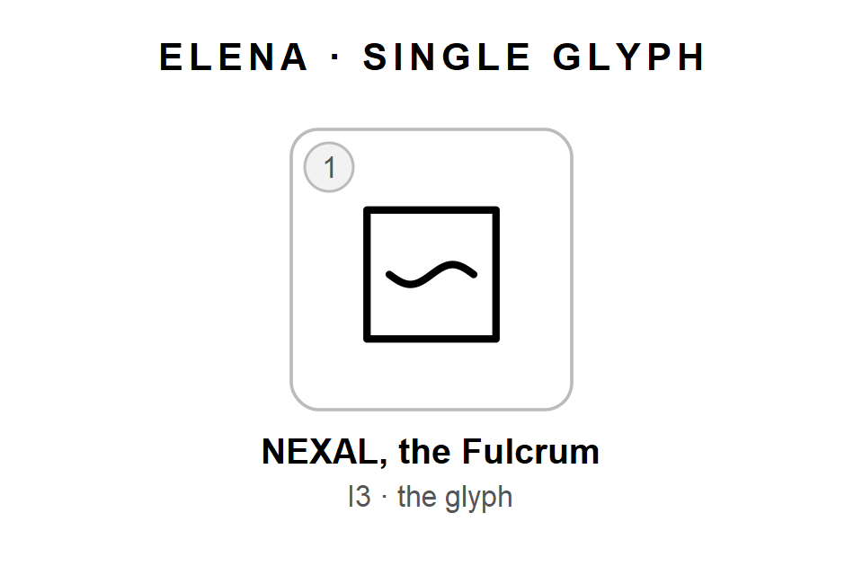

Her first reaction: "A box with a wave in it. Nothing, really."

She reads both faces: the search for balance, the balance that becomes paralysis. She tries each one against her situation, honestly, for a few minutes. Nothing moves. The offer does not feel like a balance, and she is not stuck. The glyph simply does not touch it.

She writes: "NEXAL. Doesn't speak to this today." Then she closes the notebook. She does not draw again.

Two weeks later, reading back through her journal, she looks at the entry once more. It still says nothing to her, and she leaves it that way.

This is a perfectly good reading. A glyph is an invitation, and some invitations do not land. That is not a failure of the reader, and it is not a hidden message waiting to be decoded. Drawing again until something fits would turn the tool into a search for the answer you want. Writing "nothing" and moving on keeps it honest, and keeps the next reading worth doing.

## Chapter 12: Living with the Glyphs

You come to know SYNOPTRA the way you come to know a friend: by spending time together. This chapter offers a few simple exercises for your first weeks, and a gentle way of keeping a reading journal so that your readings grow into something larger over time.

### Six exercises for the first weeks

Take them in order, one or two a week. Each one needs only ten or twenty minutes.

1. **Draw the ten pieces.** On a blank page, draw the five shapes down the side and the five marks across the top. Then fill in all twenty-five glyphs by combining them, without looking at the book. Check your grid against Chapter 4. Repeat it now and then until it feels easy.
2. **Guess from the grid.** Choose five glyphs at random. For each one, cover its name and write what you think it means, using only its row and phase. Then read its portrait in Chapter 7. Wherever your guess and the portrait differ, the glyph is starting to become yours.
3. **Walk along a row.** Pick one dimension and read its five glyphs in order, from Latency to Completion, as a single small story. Write it in five sentences. Try a different row each day.
4. **Walk down a column.** Pick one phase and look at its five glyphs together. What does Crisis look like in the self, in a relationship, in action, in understanding, in the shape of a life? Find an example from your own experience for each.
5. **Find the shadow.** Draw one glyph each day for a week. Each evening, write one real example of its light and one of its shadow from your own life. If the shadow is hard to find, look a little longer. It is often the more useful half.
6. **Learn the letters.** Write the alphabet from A to Z, skipping Y, and write each glyph's name beside its letter. Once you can do this, your journal notes will read at a glance.

### Your reading journal

A reading that is not written down tends to fade as quickly as a mood. A reading on paper can be revisited, compared with others, and held up against what really happened. Your journal is what turns single readings into real self-knowledge.

Use whatever you will actually keep: a paper notebook, a file on your phone. What matters is that each entry follows the same simple pattern, so that you can find your way back. Start with the date, the spread and your question. Write the glyphs in short form. Note your first reactions, a line about the shape of the spread, which face each glyph showed, your gathering sentence, and your small step. Then leave one empty line at the bottom, for later.

An entry might look like this:

```markdown
2026-10-04 | Quincunx | What is happening in me around this move?
M E H P C   (R3 T4 K1 I2 M5)

First reactions:
  M water, a face on water
  E finally getting out
  ...

Shape: every row and phase, once each.
Faces: E light, H shadow, P shadow, C light, M both.

Reading: The move is a mirror...
Step: list what I would leave behind.

Looking back (+2 weeks):
```

### Looking back

Two weeks after a reading, or whenever the situation has moved on, return to that empty line and fill it in. Ask yourself what in the reading turned out to matter, what you missed or misread, and whether you took your small step, and what happened if you did.

This is the most honest part of the practice, and often the most rewarding. Little by little, it shows you your own habits as a reader: the shadows you never choose, the rows you always lean on, the steps you somehow never take. Those patterns can tell you more than any single reading.

### Reading your whole journal

Every few months, sit down with all your readings and look at them together.

Notice which rows and phases you **write about** most. The draw itself spreads them fairly evenly over time, so if your notes keep returning to the same areas, that tells you where your attention naturally goes.

Look for **glyphs you always read the same way**. A glyph that is always shadow for you, or always light, may be one you have stopped really seeing. The next time it comes up, try the other face first.

And look for **questions that keep coming back**. When the same question appears again and again, the question itself may be the message. Ask what keeps it open.

### Reading with a friend

SYNOPTRA is made for quiet, solitary use, but it can be lovely to practice with someone you trust. Each of you draws for your own question and reads aloud. The one listening offers only open questions, such as "What else could that shadow be?", and never an interpretation. This one rule protects the heart of the practice: a reading always belongs to the person who asked.

# Part Four: Boundaries

## Chapter 13: Using SYNOPTRA with Care

We are near the end of our time together, and I want to close with a few honest words. SYNOPTRA is a self-reflection tool, and like any tool it is only as good as the care with which it is used.

### What the glyphs cannot do

The glyphs **cannot tell the future**. Even the "tendency" in the Time Triad describes the direction of the present, not what will happen. They **cannot know another person**: a reading about a relationship speaks only to your side of it, never to what someone else thinks, feels or intends. They **cannot replace facts**. Questions of health, money, law and safety need real information and real professionals. A reading can help you notice how you feel about such a decision, but it cannot make the decision for you. And they **cannot heal**. SYNOPTRA can support reflection, but it does not treat anxiety, depression, grief, trauma or any other pain that needs care.

### When to reach out

Sometimes a reading touches something tender: a distress that does not fade, or a weight you have been carrying alone for a long time. When that happens, the kindest next step is not another reading. It is to talk with someone: a person you trust and, if the difficulty stays with you, a psychologist or another qualified professional. SYNOPTRA can help you notice that something needs attention. It should never be the place where that attention ends.

### Habits to gently avoid

A few habits can quietly turn a mirror into something else. Most of us fall into them now and then, so there is no need for guilt, only a little awareness.

**Drawing again until the answer feels right** turns a tool for seeing into a tool for being reassured. Try one reading per question, and if you disagree with it, write down why. That disagreement is often the real reading.

**Reading many times a day on the same worry** tends to feed the worry rather than understand it. Read once, then take your small step and let the question rest.

**Letting the glyphs decide** hands your judgment to chance. A glyph can offer a view, but the choice always remains yours.

**Reading about other people's lives**, when they have not asked, places your view on them and calls it insight. Keep your readings to your own side of a situation.

**Always choosing the kinder face** avoids the shadow, which is so often the more useful half. Before you choose, try to make the case for the other face.

### Reading for someone else

If a friend asks you to read for them, you can be a wonderful guide. Show them the grid, read the portraits aloud, ask open questions, keep them company. But try not to tell them what their glyphs mean for their life. That would place you in the very role SYNOPTRA leaves empty on purpose: an interpreter standing between a person and their own reflection. The best gift you can offer is a good question.

### A last word

Everything in this book comes back to one simple idea. A symbol helps because it gives your attention a new place to stand. It stops helping when it pretends to be more than that. If you keep SYNOPTRA small, honest and in your own hands, it will go on showing you what you already half know. That is all a mirror can do, and it is a great deal.

I hope your glyphs serve you well.

## Appendix: Quick Reference

Everything you need at the table, on one page.

### Dimensions and phases

| Row | Dimension | Shape | Question |
| :-- | :-- | :-- | :-- |
| T | Transformation | Circle | What is changing in me? |
| R | Relation | Mandorla | What is happening between us? |
| M | Movement | Triangle, apex up | How am I moving? |
| K | Knowledge | Rhombus | What do I know, and how? |
| I | Integration | Square | How do the parts fit? |

| Column | Phase | Mark | Sense |
| :-- | :-- | :-- | :-- |
| 1 | Latency | Dot at center | Present, not yet active |
| 2 | Crisis | Gap at top | Breaks or opens |
| 3 | Process | Wavy line inside | Under way, unseen |
| 4 | Manifestation | Line from center past top | Comes out, becomes visible |
| 5 | Completion | Smaller concentric copy | Closes and integrates |

### All twenty-five glyphs

| Code | Initial | Name | Concept | Meaning | Shadow |
| :-- | :-- | :-- | :-- | :-- | :-- |
| T1 | G | GERMA | Seed | Latent potential | Endless waiting |
| T2 | B | BREKA | Fracture | Necessary breaking | Collapse that opens nothing |
| T3 | U | UMVEL | Chrysalis | Inner transformation | Refusal to come out |
| T4 | E | EMRAL | Emergence | New self made manifest | Premature exposure |
| T5 | A | ASKOR | Ash | Cycle that feeds a new one | Clinging to what is over |
| R1 | L | LIMYR | Threshold | Boundary as invitation | Defensive barrier |
| R2 | D | DISTEN | Abyss | Difference coming to light | Separation |
| R3 | M | MIREN | Mirror | Seeing oneself in the other | Blind projection |
| R4 | T | THEKNA | Knot | Declared bond | Bond that traps |
| R5 | S | SONAL | Resonance | Two voices in tune | Fusion, lost voice |
| M1 | R | RADHEN | Root | Chosen stability | Rigidity |
| M2 | J | JEKTA | Leap | Deliberate risk | Impulsiveness |
| M3 | F | FLUEN | Current | Flow, adaptation | Drifting |
| M4 | V | VEKTOR | Path | Deliberate direction | Rigid course |
| M5 | C | CYRKEL | Return | Coming home enriched | Going in circles |
| K1 | H | HULMEN | Veil | Necessary mystery | Denial |
| K2 | Q | QUERIK | Labyrinth | Disorientation that drives search | Confusion |
| K3 | I | IKNOR | Trace | Following clues | Hearsay |
| K4 | K | KLAVEN | Key | Insight that unlocks | Illusion of full understanding |
| K5 | O | OKULAR | Witness | Seeing without judging | Detachment |
| I1 | Z | ZERAN | Void | Space that prepares | Sense of loss |
| I2 | P | PARTEN | Fragment | Healthy separation | Fragmentation |
| I3 | N | NEXAL | Fulcrum | Seeking balance | Indecision |
| I4 | X | XUNDA | Overflow | Fullness seeking expression | Excess that breaks |
| I5 | W | WEVAN | Weave | Integrated multiplicity | Net that imprisons |

### The procedure

1. Find an open question and write it down.
2. Draw your glyphs and lay them in their positions.
3. Look at each shape and write your first reaction.
4. Weigh light and shadow.
5. Look at the shape of the spread: repeated, missing and distant rows and phases.
6. Read the glyphs together; write one gathering sentence and one small step.

### The spreads

| Spread | Positions, in placement order |
| :-- | :-- |
| Single draw | One glyph |
| Time Triad | Past, present, tendency |
| Knot Triad | Situation, obstacle, resource |
| Quincunx | Center (heart of the matter), above (what you know), below (what remains in shadow), left (what holds you back), right (what draws you forward) |

### Dice

| Roll | Row die | Phase die |
| :-- | :-- | :-- |
| 1 | T Transformation | Latency |
| 2 | R Relation | Crisis |
| 3 | M Movement | Process |
| 4 | K Knowledge | Manifestation |
| 5 | I Integration | Completion |
| 6 | Roll again | Roll again |

Use two ordinary six-sided dice, ideally of different colors. Roll both again if the glyph has already been drawn.
